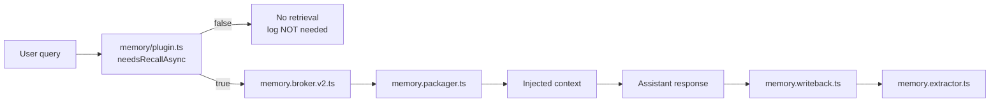
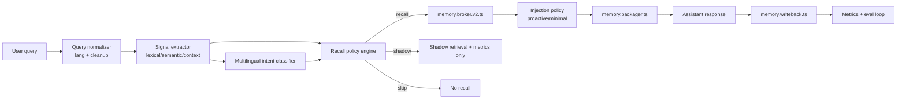

# Memory recall intelligence plan

Roadmap operativa per migliorare recall e injection

---

## 1) Diagnosi root-cause del problema attuale (perché query dirette possono fallire)

### Problema principale
Il collo di bottiglia non è il retrieval, ma il **trigger pre-retrieval** in `packages/opencode/src/kiloclaw/memory/plugin.ts`.

### Root causes concrete
- **Gate troppo rigido e fragile**: `needsRecallAsync()` dipende da regex + `implicitIndicators` limitati, con optional embedding similarity su un solo template.
- **Coverage linguistica bassa**: pattern hardcoded non coprono varianti naturali (Italiano, Inglese, code-switching, typo, paraphrase).
- **Single-template semantic check**: similarità contro un unico template crea falsi negativi quando l’intento è corretto ma espresso diversamente.
- **No uncertainty handling**: decisione binaria recall/no-recall senza banda di incertezza e senza policy di fallback.
- **No adaptive policy**: nessun learning loop da outcome reali (es. recall utile/non utile), quindi soglie non si auto-tarano.
- **No query decomposition**: richieste composte (task + memoria implicita) non vengono splittate in segnali separati.
- **Logging insufficiente per tuning**: esiste log `"[MEMORY-PLUGIN] recall NOT needed"`, ma mancano feature-level decision traces utili per debug quantitativo.

### Effetto pratico
Query dirette tipo *“what did we decide about auth token rotation?”* o *“ricordamelo dal piano di ieri”* possono fallire quando non matchano i pattern, impedendo l’uso della pipeline avanzata in `memory.broker.v2.ts`.

---

## 2) Architettura attuale ricostruita (componenti, flusso, punti forti/deboli)

### Componenti attuali
- **Trigger/Gating**: `memory/plugin.ts` (`needsRecallAsync`)
- **Retrieval V2**: `memory.broker.v2.ts`
  - candidate generation multi-layer: working, episodic, semantic, procedural
  - ranking + re-ranking + graph boost + scope weighting + `applyBudget`
- **Writeback**: `memory.writeback.ts` (working + episodic + async extractor)
- **Extractor**: `memory.extractor.ts` rule-based regex
- **Packaging/Injection**: `memory.packager.ts`
- **Metrics**: `memory.metrics.ts` (copertura limitata)
- **Flag**: `Flag.KILO_EXPERIMENTAL_MEMORY_V2` già default-enabled

### Flusso attuale

### Punti forti
- Retrieval backend già sofisticato e stratificato.
- Ranking modulare con graph boost e budgeting.
- Writeback pipeline già presente e asincrona.
- Feature flag V2 già attivo, quindi base pronta per rollout rapido.

### Punti deboli
- Trigger statico limita fortemente recall rate utile.
- Osservabilità decisionale debole nel pre-gate.
- Extractor regex-only limita qualità delle memorie future.
- Packaging non governato da policy adattiva (proactive vs minimal).

---

## 3) Best practices 2025-2026 per trigger dinamico e multilingual memory recall (no hardcoded-only patterns)

### Pattern architetturali raccomandati
- **Hybrid intent detection**: lexical rules + multilingual embeddings + lightweight classifier.
- **Two-stage gating**: 
  - Stage A: cheap signals (rules, entities, discourse markers)
  - Stage B: semantic classifier only se A è incerto.
- **Uncertainty-aware decisions**: banda grigia con shadow recall, non solo yes/no.
- **Policy-based recall**: decisione guidata da `RecallPolicyEngine` con score breakdown.
- **Context budget governance**: dynamic token budget per evitare context pollution.
- **Intent taxonomy versionata**: recall intent types (`explicit_recall`, `project_context`, `continuation`, `preference`, `none`).
- **Multilingual normalization**: lingua detection + canonical intent mapping cross-lingua.
- **Eval-driven tuning**: soglie e pesi calibrati su benchmark offline + online A/B.

### Anti-pattern da evitare
- Regex-only gating.
- Single-template similarity check.
- Hardcoded thresholds senza periodic retuning.
- Injection aggressiva senza confidence e relevance cap.

---

## 4) Target architecture proposta (Recall Policy Engine, multilingual intent classifier, uncertainty gating, proactive context injection policy)

### Obiettivo
Rendere il trigger **probabilistico, multilingual, spiegabile, governato da policy**, mantenendo `memory.broker.v2.ts` come motore retrieval centrale.

### Architettura target

### Moduli proposti
- **RecallPolicyEngine** (nuovo)
  - Input: feature signals + classifier probabilities + runtime context
  - Output: `{decision, confidence, reason_codes, thresholds_used}`
- **Multilingual intent classifier** (nuovo)
  - Small model/adapter per intent recall; fallback su embeddings similarity multi-prototype
- **Uncertainty gating**
  - Decisioni `recall | shadow | skip` con banda di incertezza
- **Injection policy layer** (nuovo)
  - Modalità `minimal`, `standard`, `proactive`
  - Cap su token, max memories, diversity per source/type
- **Decision observability**
  - Evento strutturato per ogni decisione gate

### Threshold iniziali suggerite (da tarare con eval)
> Valori seed, **non definitivi**. Devono essere tuned su dataset e online metrics.

- `p_recall >= 0.62` → `recall`
- `0.48 <= p_recall < 0.62` → `shadow`
- `< 0.48` → `skip`
- `explicit_recall_phrase_boost = +0.18`
- `cross-lingual semantic sim >= 0.42` considerato segnale positivo
- `max_injected_memories = 6` (default), `proactive_max = 8`
- `max_memory_tokens = min(1200, 0.22 * model_context_window)`
- `min_diversity_sources = 2` quando possibile (es. episodic + procedural)

---

## 5) Piano implementazione dettagliato per fasi con task concreti, file interessati, feature flags, test strategy

### Fase 0 — Baseline & instrumentation (1 sprint)
**Obiettivo:** misurare prima di cambiare logica.

**Task**
1. Estendere eventi metrici in `memory.metrics.ts`:
   - `recall_gate_decision`
   - `recall_gate_confidence`
   - `recall_gate_reason_codes[]`
   - `shadow_recall_hit@k`
2. Aggiungere decision trace in `memory/plugin.ts` con payload strutturato.
3. Definire dataset eval iniziale (IT/EN) da log anonimi + synthetic prompts.

**File principali**
- `packages/opencode/src/kiloclaw/memory/memory.metrics.ts`
- `packages/opencode/src/kiloclaw/memory/plugin.ts`
- `packages/opencode/test/...` (nuovi test eval fixtures)

**Feature flags**
- `KILO_MEMORY_RECALL_POLICY_V1` (default false)
- `KILO_MEMORY_SHADOW_MODE` (default true in staging)

**Test strategy**
- Unit: serializzazione metric events
- Integration: plugin emits decision trace sempre
- Regression: zero behavior change quando flags off

---

### Fase 1 — Recall Policy Engine (2 sprint)
**Obiettivo:** separare decisione recall dalla logica ad-hoc.

**Task**
1. Creare `memory.recall-policy.ts` (nuovo modulo) con:
   - score aggregation
   - threshold policy
   - reason codes standardizzati
2. Refactor `needsRecallAsync()` in `plugin.ts`:
   - delega a policy engine
   - mantiene backward-compatible path dietro flag
3. Introdurre modalità decisione tri-state: `recall/shadow/skip`.

**File principali**
- `packages/opencode/src/kiloclaw/memory/memory.recall-policy.ts` (new)
- `packages/opencode/src/kiloclaw/memory/plugin.ts`
- `packages/opencode/src/kiloclaw/memory/memory.metrics.ts`

**Feature flags**
- `KILO_MEMORY_RECALL_POLICY_V1` (rollout progressivo)
- `KILO_MEMORY_RECALL_TRI_STATE` (default false)

**Test strategy**
- Unit tests policy table-driven (50+ cases)
- Property tests su monotonicità score/decision
- Integration con broker mockless (real retrieval path in test fixture)

---

### Fase 2 — Multilingual intent classifier (2 sprint)
**Obiettivo:** ridurre falsi negativi su query naturali IT/EN.

**Task**
1. Nuovo modulo `memory.intent.ts`:
   - `classifyRecallIntent(query, lang, ctx) -> {p_recall, intent_type}`
2. Language normalization leggera (stopwords multilingual, punctuation normalization, typo-tolerant matching).
3. Multi-prototype semantic similarity (non single-template):
   - intent prototypes per categoria (`explicit`, `continuation`, `project-history`, `preference`)
4. Fuse classifier + lexical signals nel policy engine.

**File principali**
- `packages/opencode/src/kiloclaw/memory/memory.intent.ts` (new)
- `packages/opencode/src/kiloclaw/memory/plugin.ts`
- `packages/opencode/src/kiloclaw/memory/memory.recall-policy.ts`

**Feature flags**
- `KILO_MEMORY_INTENT_CLASSIFIER_V1` (default false)
- `KILO_MEMORY_MULTILINGUAL_RECALL` (default false)

**Test strategy**
- Goldens IT/EN con paraphrase set
- Precision/Recall offline report automatico in CI
- Adversarial tests: typo, mixed language, indirect prompts

---

### Fase 3 — Proactive injection policy (1-2 sprint)
**Obiettivo:** migliorare utilità senza over-injection.

**Task**
1. Nuovo modulo `memory.injection-policy.ts`:
   - decide `minimal/standard/proactive`
   - enforce token and diversity budgets
2. Integrare con `memory.packager.ts`:
   - ranking-aware trimming
   - duplicate suppression
3. Aggiungere segnali task-critical:
   - high uncertainty response risk
   - long-session continuation hints

**File principali**
- `packages/opencode/src/kiloclaw/memory/memory.injection-policy.ts` (new)
- `packages/opencode/src/kiloclaw/memory/memory.packager.ts`
- `packages/opencode/src/kiloclaw/memory/memory.metrics.ts`

**Feature flags**
- `KILO_MEMORY_PROACTIVE_INJECTION_V1` (default false)
- `KILO_MEMORY_BUDGET_ENFORCER_V1` (default true)

**Test strategy**
- Snapshot tests pacchetti memoria
- Token-budget invariants
- Relevance@k end-to-end su benchmark interno

---

### Fase 4 — Extractor uplift e quality loop (1 sprint)
**Obiettivo:** migliorare qualità writeback per recall futuro.

**Task**
1. Estendere `memory.extractor.ts` con pattern intent-aware (non solo regex statiche).
2. Collegare segnali post-response quality:
   - memory used vs ignored
   - user correction signals
3. Aggiornare writeback prioritization in `memory.writeback.ts`.

**File principali**
- `packages/opencode/src/kiloclaw/memory/memory.extractor.ts`
- `packages/opencode/src/kiloclaw/memory/memory.writeback.ts`
- `packages/opencode/src/kiloclaw/memory/memory.metrics.ts`

**Feature flags**
- `KILO_MEMORY_EXTRACTOR_V2` (default false)

**Test strategy**
- Extraction precision test set
- Async writeback reliability tests
- Non-regression su latency budget

---

### Esempi trigger behavior (IT + EN)
| Query | Expected decision | Motivo |
|---|---|---|
| “Ricordami cosa avevamo deciso sui branch naming” | `recall` | explicit recall phrase + project history |
| “Prima hai detto qualcosa sulla strategia test, riprendi da lì” | `recall` | continuation intent |
| “Implement the API handler for retries” | `shadow`/`skip` | no clear recall intent, task possibly standalone |
| “What did we agree yesterday about memory thresholds?” | `recall` | temporal + agreement + memory intent |
| “Fix lint errors in this file” | `skip` | direct action command, no memory cue |
| “Usa le preferenze che ti avevo dato per commit messages” | `recall` | preference recall intent |

---

## 6) KPI/SLO e observability plan

### KPI principali
- **Recall Trigger Recall@Intent**: % query memory-relevant che passano il gate.
- **False Positive Rate del gate**: % recall inutili su query non memory-relevant.
- **Answer Helpfulness Delta**: uplift qualità risposta con recall vs senza (A/B).
- **Memory Hit@k**: almeno una memoria rilevante nei top-k recuperati.
- **Context Waste Ratio**: token memoria iniettati ma non usati.
- **Latency Overhead P95**: incremento latenza dovuto al recall path.

### SLO iniziali suggeriti
- Trigger Recall@Intent ≥ **0.90**
- Gate False Positive Rate ≤ **0.15**
- Retrieval Hit@5 ≥ **0.80**
- Injection Waste Ratio ≤ **0.25**
- P95 recall overhead ≤ **180ms** (excluding model generation)

### Observability events minimi
- `memory.recall.gate` `{decision, p_recall, lang, reasons, threshold_version}`
- `memory.recall.shadow` `{would_recall, hit_at_k, top_score}`
- `memory.injection` `{mode, tokens, memories_count, diversity}`
- `memory.outcome` `{used_signals, user_correction, followup_success}`

### Dashboard consigliate
- Funnel: query → gate decision → retrieval hit → response uplift
- Breakdown per lingua (`it`, `en`, `mixed`)
- Heatmap reason codes vs false negatives

---

## 7) Rollout graduale (shadow mode, canary, fallback) e risk mitigation

### Strategia rollout
1. **Shadow mode (100% staging, 10-20% prod)**  
   Nuovo policy engine valuta ma non impatta risposta, raccoglie metriche comparate.
2. **Canary (5% prod)**  
   Attivazione decisionale reale con fallback automatico.
3. **Progressive ramp**  
   5% → 15% → 30% → 60% → 100% con gate su KPI.
4. **Full rollout con guardrails**  
   Threshold freeze + monitor giornaliero prime 2 settimane.

### Fallback strategy
- Se anomalie KPI: switch immediato a legacy gating in `plugin.ts` via flag.
- Se latenza supera budget: force `skip` su low-confidence path.
- Se noise injection aumenta: fallback a `minimal` injection mode.

### Risk principali e mitigazioni
- **Over-recall** → context pollution  
  Mitigare con budget cap, diversity control, relevance threshold.
- **Under-recall in multilingual**  
  Mitigare con classifier + prototypes cross-lingua + eval set bilanciato.
- **Latency spikes**  
  Mitigare con two-stage gating e short-circuit su segnali forti.
- **Metric drift**  
  Mitigare con threshold versioning e weekly retuning pipeline.

---

## 8) Acceptance criteria finale

### Functional
- Query memory-relevant IT/EN superano il gate con Recall@Intent target.
- Decisione gate produce sempre reason codes e confidence.
- Tri-state decision (`recall/shadow/skip`) attivo e testato.
- Injection policy applica cap token/memories con invariant sempre rispettati.

### Quality
- Miglioramento misurabile di helpfulness vs baseline in A/B test.
- Riduzione falsi negativi su set diretto/parafrasi almeno **-40%** vs baseline.
- No regressioni sui path non-memory-centric.

### Reliability
- P95 overhead entro SLO.
- Fallback via flag verificato in test e in canary.
- Dashboard e alert operativi prima del 30% rollout.

### Delivery artifacts richiesti
- Nuovi moduli implementati e coperti da test.
- Eval report offline (IT/EN + mixed) con threshold tuning proposto.
- Runbook operativo di rollout/rollback documentato.
