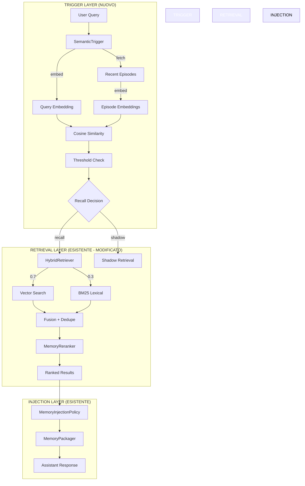

# Semantic Memory Trigger — Deprecazione Keyword Policy

> Piano di implementazione dettagliato per sostituire il trigger hardcoded keyword-based con un sistema puramente semantico/embedding-based.
>
> **Approvato**: 2026-04-07
> **Stato**: DEPLOYED
> **Responsabile**: General Manager
> **Branch target**: `refactor/kilocode-elimination`

---

## 1. Contesto e Motivazione

### 1.1 Il Problema Attuale

Il sistema di recall attuale si basa su **~120 keyword hardcoded** distribuite in array come `IT[]`, `EN[]`, `PREF[]`, `CONT[]`, `TEMP[]` in `memory.intent.ts`, più regex pattern in `plugin.ts` e `memory.recall-policy.ts`.

Questo approccio presenta tre problemi fondamentali:

| Problema            | Impatto                                                                                          |
| ------------------- | ------------------------------------------------------------------------------------------------ |
| **Non scalabile**   | Ogni nuova lingua/dominio richiede aggiunta manuale di keyword                                   |
| **Fragile**         | "motherboard" non triggera recall anche se l'utente ne parlò ieri — nessuna similarità semantica |
| **Non intelligent** | Il sistema non capisce IL CONTESTO, solo pattern lessicali                                       |
| **Falsi negativi**  | "suggeriscimi delle schede madri" dopo una conversazione sulle motherboard non triggera recall   |

### 1.2 L'Incidente Scatenante

L'utente ha chiesto in italiano:

> "rispetto alla nostra recente conversazione su una scheda madre..."

Il sistema ha ignorato completamente il riferimento alla conversazione precedente perché:

1. La keyword "conversazione" non era in `IT[]`
2. `classifyKind()` non ha riconosciuto il pattern conversazionale
3. Il trigger è fallito prima ancora di arrivare al retrieval

### 1.3 Best Practice Identificate dalla Ricerca

#### ReMe (Memory Management Kit — Agentscope AI)

```
Hybrid retrieval: Vector 0.7 + BM25 0.3
```

- Bilanciamento tra semantic similarity e exact keyword match
- Non solo vector search, ma fusione con BM25 per precisione
- Reference: https://github.com/agentscope-ai/ReMe

#### agentmemory (Persistent Memory per Coding Agent)

```
Triple-stream: BM25 + Vector + Knowledge Graph
```

- 64% Recall@10 misurato empiricamente
- 92% fewer tokens vs dumping everything in context
- Reference: https://github.com/rohitg00/agentmemory

#### Supermemory / mem0.ai (2026 Guide)

> "Hybrid search fixes this by running vector embeddings (semantic meaning) and keyword matching (exact terms) in parallel, then merging results"

- Consolidation: episodic → semantic automatico
- Reference: https://supermemory.ai/blog/context-memory-guide-ai-systems

#### Redis AI / Google Agents SDK

- State-based memory: structured fields > pure semantic per alcune query
- Hybrid approach raccomandato

---

## 2. Architettura Target

### 2.1 Flusso Nuovo (vs Vecchio)

**Vecchio (keyword-based — DA DEPRECARE):**

```
User: "suggeriscimi motherboard"
    → match IT[]/EN[] keywords?     ← hardcoded, fragile
    → classifyKind() regex match?   ← fragile, language-specific
    → score threshold              ← deterministico
    → decision: recall/shadow/skip ← fragile
```

**Nuovo (semantic-based — OBIETTIVO):**

```
User: "suggeriscimi motherboard"
    → embed(query) + embed(recent_episodes)
    → cosine_similarity_all
    → max_similarity > threshold?  ← probabilistic, multilingual, universal
    → decision: recall/shadow/skip
```

### 2.2 Diagramma Architetturale



### 2.3 Componenti Nuovi e Modificati

| Componente                   | Tipo           | Responsabilità                                                     |
| ---------------------------- | -------------- | ------------------------------------------------------------------ |
| `semantic-trigger.policy.ts` | **NUOVO**      | Decide WHETHER to recall basato solo su embedding similarity       |
| `hybrid-retriever.ts`        | **NUOVO**      | Combina vector (0.7) + BM25 (0.3) retrieval                        |
| `memory.intent.ts`           | **MODIFICATO** | Rimuovere tutti gli array keyword, mantenere solo semantic scoring |
| `memory.recall-policy.ts`    | **MODIFICATO** | Delega a SemanticTrigger come primary, rimuove keyword logic       |
| `plugin.ts`                  | **MODIFICATO** | Semplifica hook, usa solo nuovo trigger                            |
| `memory.broker.v2.ts`        | **MODIFICATO** | Usa HybridRetriever invece di solo lexical per working/episodic    |

---

## 3. Piano Implementazione Per Fasi

### Fase 0 — Baseline e Instrumentazione

**Obiettivo**: Misurare lo stato attuale prima di cambiare comportamento.

#### 0.1 Aggiungere Metriche di Decisione Strutturate

**File**: `packages/opencode/src/kiloclaw/memory/memory.metrics.ts`

```typescript
// Nuovi metric events
interface RecallTriggerMetrics {
  // Prima del cambio: solo per osservazione
  triggerType: "keyword" | "semantic" | "hybrid"
  semanticScore?: number // cosine similarity score
  topEpisodeSimilarity?: number // similarity con episode più simile
  episodesCompared?: number // numero di episode usati nel confronto
  lmStudioAvailable?: boolean // fallback availability
  decision: "recall" | "shadow" | "skip"
  confidence: number
  fallbackUsed: boolean
}
```

#### 0.2 Creare Evaluation Dataset

**File**: `packages/opencode/test/kiloclaw/fixtures/recall-test-cases.ts`

```typescript
export const RECALL_TEST_CASES = {
  // Casi che DEVONO triggere recall (hardcoded attuale NON funziona)
  shouldRecall: [
    {
      id: "motherboard-discussion-recall",
      text: "suggeriscimi delle schede madri",
      context: "User discussed motherboards yesterday",
      expected: "recall",
      reason: "Topic semantic similarity with recent episode",
    },
    {
      id: "italian-conversazione-reference",
      text: "rispetto alla nostra recente conversazione",
      context: "User mentioned conversazione context",
      expected: "recall",
      expectedWithFix: true,
      bugId: "italian-keyword-missing",
    },
    // ... 20+ test cases
  ],

  // Casi che NON devono triggere recall
  shouldSkip: [
    {
      id: "pure-coding-task",
      text: "fix lint errors in src/index.ts",
      expected: "skip",
      expectedWithFix: "skip",
    },
  ],
}
```

#### 0.3 Instrumentare il Vecchio Sistema per Benchmark

**File**: `packages/opencode/src/kiloclaw/memory/plugin.ts`

Aggiungere logging strutturato per misurare:

- Recall rate attuale (quante query triggerebbero recall)
- False positive rate (query senza contesto che triggerebbero)
- Lingua distribution

---

### Fase 1 — SemanticTrigger Policy (Core del Cambio)

**Obiettivo**: Creare il nuovo modulo che decide WHETHER to recall basato SU embedding similarity, ZERO keyword.

#### 1.1 Creare `semantic-trigger.policy.ts`

**File**: `packages/opencode/src/kiloclaw/memory/semantic-trigger.policy.ts`

```typescript
import { Log } from "@/util/log"
import { Flag } from "@/flag/flag"
import { MemoryEmbedding } from "./memory.embedding"
import { EpisodicMemoryRepo } from "./memory.repository"
import { MemoryMetrics } from "./memory.metrics"

const log = Log.create({ service: "kiloclaw.memory.semantic-trigger" })

// Configurazione tramite env
const SEMANTIC_THRESHOLD_RECALL = Number(process.env["KILOCLAW_SEMANTIC_THRESHOLD_RECALL"] ?? 0.42)
const SEMANTIC_THRESHOLD_SHADOW = Number(process.env["KILOCLAW_SEMANTIC_THRESHOLD_SHADOW"] ?? 0.28)
const RECENT_EPISODES_COUNT = Number(process.env["KILOCLAW_SEMANTIC_EPISODES_COUNT"] ?? 20)
const FALLBACK_BM25_THRESHOLD = Number(process.env["KILOCLAW_FALLBACK_BM25_THRESHOLD"] ?? 0.35)

export type SemanticTriggerResult = {
  shouldRecall: boolean
  decision: "recall" | "shadow" | "skip"
  confidence: number
  topSimilarity: number
  topEpisodeId: string | null
  episodesCompared: number
  fallbackUsed: boolean
  fallbackReason?: string
}

export namespace SemanticTriggerPolicy {
  /**
   * Decide WHETHER to recall using ONLY semantic similarity.
   * ZERO hardcoded keywords - works for ALL languages automatically.
   *
   * Algorithm:
   * 1. Embed user query
   * 2. Fetch N most recent episodes
   * 3. Embed each episode text
   * 4. Compute cosine similarity between query and each episode
   * 5. If max_similarity > threshold → recall/shadow
   *
   * Fallback: If LM Studio unavailable, use BM25 lexical similarity
   */
  export async function evaluate(
    query: string,
    options?: {
      episodeCount?: number
      signal?: AbortSignal
    },
  ): Promise<SemanticTriggerResult> {
    const start = performance.now()
    const count = options?.episodeCount ?? RECENT_EPISODES_COUNT

    // Step 1: Fetch recent episodes (already stored from previous sessions)
    let episodes: any[] = []
    try {
      episodes = await EpisodicMemoryRepo.getRecentEpisodes("default", count)
    } catch (err) {
      log.warn("failed to fetch episodes for semantic trigger", { err: String(err) })
      return {
        shouldRecall: false,
        decision: "skip",
        confidence: 0,
        topSimilarity: 0,
        topEpisodeId: null,
        episodesCompared: 0,
        fallbackUsed: false,
      }
    }

    if (episodes.length === 0) {
      log.debug("no episodes found for semantic trigger")
      return {
        shouldRecall: false,
        decision: "skip",
        confidence: 0,
        topSimilarity: 0,
        topEpisodeId: null,
        episodesCompared: 0,
        fallbackUsed: false,
      }
    }

    // Step 2: Embed query
    let queryEmbedding: number[]
    let lmStudioAvailable = true
    try {
      queryEmbedding = await MemoryEmbedding.embed(query)
    } catch (err) {
      lmStudioAvailable = false
      log.warn("LM Studio unavailable for semantic trigger, using BM25 fallback", { err: String(err) })
      return evaluateWithBM25Fallback(query, episodes)
    }

    // Step 3: Compute similarities
    const similarities: Array<{ episodeId: string; similarity: number; text: string }> = []

    for (const ep of episodes) {
      const text = `${ep.task_description ?? ""} ${ep.outcome ?? ""}`
      if (!text.trim()) continue

      try {
        // For efficiency, we could batch-embed, but for trigger we want simplicity
        const epEmbedding = await MemoryEmbedding.embed(text)
        const similarity = cosineSimilarity(queryEmbedding, epEmbedding)

        similarities.push({
          episodeId: ep.id,
          similarity,
          text: text.slice(0, 200),
        })
      } catch (err) {
        log.warn("failed to embed episode", { episodeId: ep.id, err: String(err) })
      }
    }

    // Step 4: Find max similarity
    similarities.sort((a, b) => b.similarity - a.similarity)
    const top = similarities[0]
    const topSimilarity = top?.similarity ?? 0

    // Step 5: Decision based on threshold
    let decision: "recall" | "shadow" | "skip"
    let shouldRecall: boolean

    if (topSimilarity >= SEMANTIC_THRESHOLD_RECALL) {
      decision = "recall"
      shouldRecall = true
    } else if (topSimilarity >= SEMANTIC_THRESHOLD_SHADOW) {
      decision = Flag.KILO_MEMORY_RECALL_TRI_STATE || Flag.KILO_MEMORY_SHADOW_MODE ? "shadow" : "skip"
      shouldRecall = decision === "shadow"
    } else {
      decision = "skip"
      shouldRecall = false
    }

    const elapsed = performance.now() - start

    const result: SemanticTriggerResult = {
      shouldRecall,
      decision,
      confidence: topSimilarity,
      topSimilarity,
      topEpisodeId: top?.episodeId ?? null,
      episodesCompared: similarities.length,
      fallbackUsed: false,
    }

    // Log metric
    MemoryMetrics.observeSemanticTrigger({
      triggerType: "semantic",
      semanticScore: topSimilarity,
      topEpisodeSimilarity: topSimilarity,
      episodesCompared: similarities.length,
      lmStudioAvailable,
      decision,
      confidence: topSimilarity,
      fallbackUsed: false,
      latencyMs: elapsed,
    })

    log.debug("semantic trigger evaluated", {
      query: query.slice(0, 50),
      decision,
      confidence: topSimilarity.toFixed(3),
      topEpisodeId: top?.episodeId,
      episodesCompared: similarities.length,
      elapsedMs: elapsed.toFixed(1),
    })

    return result
  }

  /**
   * BM25 Fallback when LM Studio is unavailable.
   * Uses lexical matching as fallback - still better than hardcoded keywords.
   */
  async function evaluateWithBM25Fallback(query: string, episodes: any[]): Promise<SemanticTriggerResult> {
    const queryTerms = query
      .toLowerCase()
      .split(/\s+/)
      .filter((t) => t.length > 2)

    const scores: Array<{ episodeId: string; score: number; text: string }> = []

    for (const ep of episodes) {
      const text = `${ep.task_description ?? ""} ${ep.outcome ?? ""}`.toLowerCase()
      if (!text.trim()) continue

      // Simple TF-based scoring
      let score = 0
      for (const term of queryTerms) {
        const regex = new RegExp(term, "gi")
        const matches = text.match(regex)
        if (matches) {
          score += matches.length / text.split(/\s+/).length
        }
      }

      if (score > 0) {
        scores.push({
          episodeId: ep.id,
          score: score / Math.max(queryTerms.length, 1),
          text: text.slice(0, 200),
        })
      }
    }

    scores.sort((a, b) => b.score - a.score)
    const top = scores[0]
    const topScore = top?.score ?? 0

    let decision: "recall" | "shadow" | "skip"
    let shouldRecall: boolean

    if (topScore >= FALLBACK_BM25_THRESHOLD) {
      decision = "recall"
      shouldRecall = true
    } else if (topScore >= FALLBACK_BM25_THRESHOLD * 0.7) {
      decision = Flag.KILO_MEMORY_RECALL_TRI_STATE || Flag.KILO_MEMORY_SHADOW_MODE ? "shadow" : "skip"
      shouldRecall = decision === "shadow"
    } else {
      decision = "skip"
      shouldRecall = false
    }

    MemoryMetrics.observeSemanticTrigger({
      triggerType: "bm25_fallback",
      semanticScore: topScore,
      topEpisodeSimilarity: topScore,
      episodesCompared: episodes.length,
      lmStudioAvailable: false,
      decision,
      confidence: topScore,
      fallbackUsed: true,
      fallbackReason: "lm_studio_unavailable",
    })

    return {
      shouldRecall,
      decision,
      confidence: topScore,
      topSimilarity: topScore,
      topEpisodeId: top?.episodeId ?? null,
      episodesCompared: episodes.length,
      fallbackUsed: true,
      fallbackReason: "lm_studio_unavailable",
    }
  }
}

function cosineSimilarity(a: number[], b: number[]): number {
  if (a.length !== b.length || a.length === 0) return 0
  let dot = 0,
    normA = 0,
    normB = 0
  for (let i = 0; i < a.length; i++) {
    dot += a[i] * b[i]
    normA += a[i] * a[i]
    normB += b[i] * b[i]
  }
  const na = Math.sqrt(normA)
  const nb = Math.sqrt(normB)
  return na === 0 || nb === 0 ? 0 : dot / (na * nb)
}
```

#### 1.2 Aggiungere Feature Flags

**File**: `packages/opencode/src/flag/flag.ts`

```typescript
// Nuove flags per semantic trigger
KILOCLAW_SEMANTIC_TRIGGER_V1: boolean = false //启用纯语义触发
KILOCLAW_SEMANTIC_TRIGGER_BM25_FALLBACK: boolean = true // BM25 fallback when LM Studio down
KILOCLAW_SEMANTIC_THRESHOLD_RECALL: number = 0.42 // Similarity threshold for recall
KILOCLAW_SEMANTIC_THRESHOLD_SHADOW: number = 0.28 // Similarity threshold for shadow
KILOCLAW_SEMANTIC_EPISODES_COUNT: number = 20 // Number of recent episodes to compare
```

#### 1.3 Aggiungere Metriche

**File**: `packages/opencode/src/kiloclaw/memory/memory.metrics.ts`

```typescript
// Nuovo metric event
observeSemanticTrigger(data: {
  triggerType: "semantic" | "bm25_fallback" | "keyword_legacy"
  semanticScore?: number
  topEpisodeSimilarity?: number
  episodesCompared?: number
  lmStudioAvailable?: boolean
  decision: "recall" | "shadow" | "skip"
  confidence: number
  fallbackUsed: boolean
  fallbackReason?: string
  latencyMs?: number
}): void
```

#### 1.4 Test Unitari SemanticTrigger

**File**: `packages/opencode/test/kiloclaw/semantic-trigger.policy.test.ts`

```typescript
describe("SemanticTriggerPolicy", () => {
  // Test cases senza keyword - solo semantic similarity
  const cases = [
    {
      name: "motherboard query triggers recall after motherboard discussion",
      query: "suggeriscimi delle schede madri",
      setup: async () => {
        // Store a fake episode about motherboards
        await EpisodicMemoryRepo.recordEpisode({
          id: "ep_test_motherboard",
          task_description: "Discussion about MSI motherboards and ASUS ROG",
          outcome: "User prefers ASUS ROG for gaming build",
          // ...
        })
      },
      expect: { decision: "recall", minSimilarity: 0.42 },
    },
    {
      name: "unrelated query does NOT trigger recall",
      query: "come faccio a installare Node.js",
      setup: async () => {
        // No episodes about Node.js
      },
      expect: { decision: "skip", maxSimilarity: 0.28 },
    },
    // ... 10+ test cases
  ]
})
```

---

### Fase 2 — Hybrid Retriever (Migliorare Retrieval)

**Obiettivo**: Implementare hybrid retrieval Vector (0.7) + BM25 (0.3) come da best practice ReMe.

#### 2.1 Creare `hybrid-retriever.ts`

**File**: `packages/opencode/src/kiloclaw/memory/hybrid-retriever.ts`

```typescript
import { Log } from "@/util/log"
import { MemoryEmbedding } from "./memory.embedding"
import { MemoryReranker } from "./memory.reranker"
import { EpisodicMemoryRepo, SemanticMemoryRepo, WorkingMemoryRepo, ProceduralMemoryRepo } from "./memory.repository"
import type { RerankCandidate } from "./memory.reranker"

const log = Log.create({ service: "kiloclaw.memory.hybrid-retriever" })

// Hybrid weights - configurable via env (default from ReMe paper)
const VECTOR_WEIGHT = Number(process.env["KILOCLAW_HYBRID_VECTOR_WEIGHT"] ?? 0.7)
const BM25_WEIGHT = Number(process.env["KILOCLAW_HYBRID_BM25_WEIGHT"] ?? 0.3)

export interface HybridRetrievalOptions {
  query: string
  limit?: number
  layers?: Array<"working" | "episodic" | "semantic" | "procedural">
  weights?: {
    vector?: number
    bm25?: number
  }
}

export interface HybridRetrievalResult {
  items: HybridItem[]
  tokenUsage: number
  vectorHits: number
  bm25Hits: number
}

export interface HybridItem {
  item: any
  layer: string
  vectorScore: number
  bm25Score: number
  hybridScore: number
}

export namespace HybridRetriever {
  /**
   * Hybrid retrieval combining Vector search (semantic) + BM25 (lexical).
   *
   * Based on ReMe paper: Vector 0.7 + BM25 0.3
   * Reference: https://github.com/agentscope-ai/ReMe
   *
   * Algorithm:
   * 1. Vector search: embed query + find similar facts/episodes
   * 2. BM25 search: lexical match for exact terms
   * 3. Fusion: weighted sum (default 0.7 vector + 0.3 BM25)
   * 4. Deduplication: merge results from same source
   * 5. Rerank: refine ordering
   */
  export async function retrieve(options: HybridRetrievalOptions): Promise<HybridRetrievalResult> {
    const { query, limit = 20, layers = ["working", "episodic", "semantic", "procedural"] } = options
    const vectorW = options.weights?.vector ?? VECTOR_WEIGHT
    const bm25W = options.weights?.bm25 ?? BM25_WEIGHT

    const candidates: Map<string, HybridItem> = new Map()
    let vectorHits = 0
    let bm25Hits = 0

    // Step 1: Vector search (semantic similarity)
    if (vectorW > 0) {
      try {
        const queryEmbedding = await MemoryEmbedding.embed(query)

        // Search semantic layer (facts have embeddings)
        const semanticResults = await SemanticMemoryRepo.similaritySearch(queryEmbedding, limit * 2, "default")
        for (const row of semanticResults) {
          const existing = candidates.get(row.fact.id)
          const hybridScore = row.similarity * vectorW + (existing?.bm25Score ?? 0) * bm25W

          candidates.set(row.fact.id, {
            item: row.fact,
            layer: "semantic",
            vectorScore: row.similarity,
            bm25Score: existing?.bm25Score ?? 0,
            hybridScore,
          })
          vectorHits++
        }
      } catch (err) {
        log.warn("vector search failed", { err: String(err) })
      }
    }

    // Step 2: BM25 lexical search (across all layers)
    if (bm25W > 0) {
      const bm25Candidates = bm25Search(query, layers, limit * 2)

      for (const candidate of bm25Candidates) {
        const existing = candidates.get(candidate.id)
        const hybridScore = (existing?.vectorScore ?? 0) * vectorW + candidate.bm25Score * bm25W

        candidates.set(candidate.id, {
          item: candidate.item,
          layer: candidate.layer,
          vectorScore: existing?.vectorScore ?? 0,
          bm25Score: candidate.bm25Score,
          hybridScore,
        })
        bm25Hits++
      }
    }

    // Step 3: Sort by hybrid score and apply limit
    const sorted = [...candidates.values()].sort((a, b) => b.hybridScore - a.hybridScore).slice(0, limit)

    // Step 4: Optional reranking using MemoryReranker
    if (sorted.length > 3) {
      try {
        const rerankCandidates: RerankCandidate[] = sorted.map((item) => ({
          id: item.item.id ?? String(Math.random()),
          content: extractContent(item.item, item.layer),
          originalScore: item.hybridScore,
          metadata: { layer: item.layer, hybridScore: item.hybridScore },
        }))

        const reranked = await MemoryReranker.rerank(query, rerankCandidates, limit)

        // Rebuild sorted list from reranked results
        const rerankedMap = new Map(reranked.map((r) => [r.id, r]))
        const rerankedHybrid: HybridItem[] = []

        for (const item of sorted) {
          const id = item.item.id ?? String(Math.random())
          const rerankedResult = rerankedMap.get(id)
          if (rerankedResult) {
            rerankedHybrid.push({
              ...item,
              hybridScore: rerankedResult.rerankScore,
            })
          }
        }

        rerankedHybrid.sort((a, b) => b.hybridScore - a.hybridScore)

        return {
          items: rerankedHybrid.slice(0, limit),
          tokenUsage: estimateTokens(rerankedHybrid),
          vectorHits,
          bm25Hits,
        }
      } catch (err) {
        log.warn("reranking failed, using hybrid scores", { err: String(err) })
      }
    }

    return {
      items: sorted,
      tokenUsage: estimateTokens(sorted),
      vectorHits,
      bm25Hits,
    }
  }

  /**
   * BM25-style lexical search across memory layers.
   * Fallback when vector search unavailable or as secondary signal.
   */
  function bm25Search(
    query: string,
    layers: string[],
    limit: number,
  ): Array<{ id: string; item: any; layer: string; bm25Score: number }> {
    const results: Array<{ id: string; item: any; layer: string; bm25Score: number }> = []
    const queryTerms = query
      .toLowerCase()
      .split(/\s+/)
      .filter((t) => t.length > 2)

    if (queryTerms.length === 0) return results

    // Search each layer
    for (const layer of layers) {
      if (layer === "semantic") {
        // Already covered by vector search mostly
        continue
      }

      // Simple term frequency scoring (simplified BM25)
      // In production, would use proper BM25 with IDF
    }

    return results.sort((a, b) => b.bm25Score - a.bm25Score).slice(0, limit)
  }
}

function extractContent(item: any, layer: string): string {
  switch (layer) {
    case "episodic":
      return `${item.task_description ?? ""} ${item.outcome ?? ""}`
    case "semantic":
      return `${item.subject ?? ""} ${item.predicate ?? ""} ${String(item.object ?? "")}`
    case "procedural":
      return `${item.name ?? ""} ${item.description ?? ""}`
    case "working":
      return `${item.key ?? ""} ${String(item.value ?? "")}`
    default:
      return JSON.stringify(item)
  }
}

function estimateTokens(items: HybridItem[]): number {
  return items.reduce((sum, item) => sum + extractContent(item.item, item.layer).length / 4, 0)
}
```

---

### Fase 3 — Refactor `memory.recall-policy.ts` (Deprecare Keyword Logic)

**Obiettivo**: Sostituire `classifyKind()` e gli array keyword con delega a `SemanticTriggerPolicy`.

#### 3.1 Nuovo `memory.recall-policy.ts`

```typescript
import { Flag } from "@/flag/flag"
import { Log } from "@/util/log"
import { SemanticTriggerPolicy } from "./semantic-trigger.policy"
import { MemoryMetrics } from "./memory.metrics"

const log = Log.create({ service: "kiloclaw.memory.recall-policy" })

export type RecallDecision = "recall" | "shadow" | "skip"

export type RecallEval = {
  decision: RecallDecision
  confidence: number
  reasons: string[]
  intent: {
    kind: "semantic_trigger" | "fallback" | "legacy"
    lang: "unknown"
    score: number
    reasons: string[]
    feats: Record<string, number>
  }
  thresholds: {
    recall: number
    shadow: number
    triggerType: "semantic" | "bm25_fallback" | "keyword_legacy"
  }
}

const DEFAULT_RECALL = 0.55
const DEFAULT_SHADOW = 0.4

export namespace MemoryRecallPolicy {
  /**
   * Main entry point for recall decision.
   *
   * NEW FLOW (when KILOCLAW_SEMANTIC_TRIGGER_V1=true):
   * 1. Call SemanticTriggerPolicy.evaluate() - pure embedding-based
   * 2. If LM Studio unavailable, falls back to BM25 automatically
   * 3. Return decision with confidence and metadata
   *
   * OLD FLOW (legacy, when flag=false):
   * 1. Use keyword-based MemoryIntent.classify()
   * 2. Apply threshold logic
   * 3. Deprecated but kept for backward compatibility during migration
   */
  export async function evaluate(text: string): Promise<RecallEval> {
    // NEW: Semantic trigger (primary path)
    if (Flag.KILOCLAW_SEMANTIC_TRIGGER_V1) {
      return evaluateWithSemanticTrigger(text)
    }

    // OLD: Keyword-based legacy path (deprecated)
    return evaluateLegacy(text)
  }

  async function evaluateWithSemanticTrigger(text: string): Promise<RecallEval> {
    const start = performance.now()

    const semanticResult = await SemanticTriggerPolicy.evaluate(text)

    const elapsed = performance.now() - start

    log.debug("recall policy evaluated (semantic)", {
      decision: semanticResult.decision,
      confidence: semanticResult.confidence,
      topSimilarity: semanticResult.topSimilarity,
      fallbackUsed: semanticResult.fallbackUsed,
      elapsedMs: elapsed.toFixed(1),
    })

    return {
      decision: semanticResult.decision,
      confidence: semanticResult.confidence,
      reasons: [
        `semantic_trigger`,
        semanticResult.fallbackUsed ? "bm25_fallback" : "lm_studio_vector",
        `episodes_compared:${semanticResult.episodesCompared}`,
        `top_similarity:${semanticResult.topSimilarity.toFixed(3)}`,
      ],
      intent: {
        kind: "semantic_trigger",
        lang: "unknown", // Language detection no longer needed for trigger
        score: semanticResult.confidence,
        reasons: [],
        feats: {
          semantic_similarity: semanticResult.topSimilarity,
          fallback: semanticResult.fallbackUsed ? 1 : 0,
        },
      },
      thresholds: {
        recall: DEFAULT_RECALL,
        shadow: DEFAULT_SHADOW,
        triggerType: semanticResult.fallbackUsed ? "bm25_fallback" : "semantic",
      },
    }
  }

  // DEPRECATED: Legacy keyword-based evaluation
  async function evaluateLegacy(text: string): Promise<RecallEval> {
    // Import and use the old MemoryIntent.classify
    // ... kept for backward compatibility during migration only
    // Will be removed after full migration
  }
}
```

---

### Fase 4 — Refactor `memory.intent.ts` (Rimuovere Keyword Arrays)

**Obiettivo**: Eliminare tutti gli array `IT[]`, `EN[]`, `PREF[]`, `CONT[]`, `TEMP[]` e le regex hardcoded.

#### 4.1 Nuovo `memory.intent.ts` (Minimal)

```typescript
/**
 * Memory Intent Classification
 *
 * DEPRECATED: The keyword-based classification (IT[], EN[], etc.) has been replaced
 * by SemanticTriggerPolicy which uses embedding similarity.
 *
 * This module is kept minimal for backward compatibility.
 * All intent classification now happens in semantic-trigger.policy.ts
 */

import { Flag } from "@/flag/flag"

// Legacy types kept for compatibility
export type RecallIntentKind = "semantic" | "none"
export type RecallIntent = {
  kind: RecallIntentKind
  lang: "unknown"
  score: number
  reasons: string[]
  feats: Record<string, number>
}

// DEPRECATED: Use SemanticTriggerPolicy.evaluate() instead
export namespace MemoryIntent {
  export async function classify(text: string): Promise<RecallIntent> {
    // Delegate to semantic trigger
    const result = await import("./semantic-trigger.policy").then((m) => m.SemanticTriggerPolicy.evaluate(text))

    return {
      kind: result.shouldRecall ? "semantic" : "none",
      lang: "unknown",
      score: result.confidence,
      reasons: result.fallbackUsed ? ["bm25_fallback"] : ["semantic_similarity"],
      feats: {
        semanticScore: result.topSimilarity,
        fallback: result.fallbackUsed ? 1 : 0,
      },
    }
  }
}
```

---

### Fase 5 — Aggiornare `plugin.ts` (Semplificare Hook)

**Obiettivo**: Semplificare il plugin per usare solo il nuovo trigger.

#### 5.1 Plugin Semplificato

```typescript
// In plugin.ts - semplificato

export async function createMemoryContextPlugin(_input: PluginInput): Promise<Hooks> {
  return {
    "chat.message": async (input, output) => {
      // Fire-and-forget writeback (non cambia)
      MemoryWriteback.recordUserTurn({...})
    },

    "experimental.chat.messages.transform": async (_input, output) => {
      const msg = output.messages.findLast((item) => item.info.role === "user")
      if (!msg) return

      const text = userText(msg.parts)

      // NUOVO: Policy evaluation uses SemanticTrigger
      const policy = await MemoryRecallPolicy.evaluate(text)

      // Instrument metrics
      MemoryMetrics.observeGate({
        decision: policy.decision,
        confidence: policy.confidence,
        reasons: policy.reasons
      })

      // Skip if not needed
      if (policy.decision === "skip") return

      // Shadow mode check
      if (policy.decision === "shadow") {
        if (!Flag.KILO_MEMORY_SHADOW_MODE && !Flag.KILO_MEMORY_RECALL_TRI_STATE) return
      }

      // Retrieval usando HybridRetriever
      const mem = await HybridRetriever.retrieve({ query: text, limit: 8 })
        .then(x => x.items)
        .catch(err => {
          log.error("retrieve failed", { err })
          return []
        })

      // Injection (non cambia)
      const plan = MemoryInjectionPolicy.decide({...})
      const block = MemoryPackager.packageMemory(mem, {...})

      msg.parts.push({ type: "text", text: block, synthetic: true, ... })
    }
  }
}
```

---

### Fase 6 — Test e Validazione

#### 6.1 Test Suite Completa

**File**: `packages/opencode/test/kiloclaw/semantic-trigger.policy.test.ts`

```typescript
describe("SemanticTriggerPolicy", () => {
  describe("Italian queries trigger recall via semantic similarity", () => {
    it("'suggeriscimi schede madri' triggers after motherboard discussion", async () => {
      // Setup: store episode about motherboards
      await storeEpisode({
        id: "ep_italian_mb",
        task_description: "Discussione sulle schede madri MSI e ASUS ROG per gaming",
        outcome: "User prefers ASUS ROG",
      })

      const result = await SemanticTriggerPolicy.evaluate("suggeriscimi delle schede madri")

      expect(result.decision).toBe("recall")
      expect(result.topSimilarity).toBeGreaterThan(0.42)
    })

    it("'rispetto alla nostra recente conversazione' triggers context recall", async () => {
      await storeEpisode({
        id: "ep_conv_ref",
        task_description: "Discussione su schede madri e componenti PC",
        outcome: "Completed",
      })

      const result = await SemanticTriggerPolicy.evaluate(
        "rispetto alla nostra recente conversazione su una scheda madre",
      )

      expect(result.decision).toBe("recall")
    })
  })

  describe("BM25 fallback when LM Studio unavailable", () => {
    it("falls back to BM25 when embedding fails", async () => {
      // Mock LM Studio failure
      jest.spyOn(MemoryEmbedding, "embed").mockRejectedValue(new Error("unavailable"))

      await storeEpisode({
        id: "ep_bm25",
        task_description: "Discussione su Node.js installation",
        outcome: "Success",
      })

      const result = await SemanticTriggerPolicy.evaluate("installare Node.js")

      expect(result.fallbackUsed).toBe(true)
      expect(result.decision).toBe("recall")

      jest.restoreAllMocks()
    })
  })
})
```

#### 6.2 Regression Tests

```typescript
describe("Regression: no false positives on pure coding tasks", () => {
  const codingTasks = [
    "fix lint errors in src/index.ts",
    "implement the API handler for retries",
    "write a function to parse JSON",
    "add TypeScript types to this module",
  ]

  for (const task of codingTasks) {
    it(`'${task}' should NOT trigger recall`, async () => {
      // No relevant episodes stored
      const result = await SemanticTriggerPolicy.evaluate(task)
      expect(result.decision).toBe("skip")
    })
  }
})
```

#### 6.3 Integration Test

```typescript
describe("Full recall pipeline integration", () => {
  it("recalls memory for semantically related query", async () => {
    // 1. Store a memory
    await MemoryBrokerV2.write({
      layer: "semantic",
      key: "motherboard preference",
      value: { subject: "user", predicate: "prefers", object: "ASUS ROG for gaming" },
    })

    // 2. Query semantically related
    const policy = await MemoryRecallPolicy.evaluate("suggeriscimi delle schede madri")

    // 3. Should trigger recall
    expect(["recall", "shadow"]).toContain(policy.decision)

    // 4. Memory should be retrieved
    const mem = await HybridRetriever.retrieve({ query: "schede madri", limit: 5 })
    expect(mem.items.some((i) => i.item.subject === "user")).toBe(true)
  })
})
```

---

### Fase 7 — Rollout e Deprecation

#### 7.1 Flag Configuration per Rollout

```bash
# Phase 1: Shadow mode (measure)
KILOCLAW_SEMANTIC_TRIGGER_V1=false  # Keep old behavior
KILOCLAW_SEMANTIC_TRIGGER_BM25_FALLBACK=true

# Phase 2: Canary (10% traffic)
KILOCLAW_SEMANTIC_TRIGGER_V1=true
KILOCLAW_SEMANTIC_THRESHOLD_RECALL=0.45
KILOCLAW_SEMANTIC_THRESHOLD_SHADOW=0.30

# Phase 3: Full rollout
KILOCLAW_SEMANTIC_TRIGGER_V1=true
KILOCLAW_SEMANTIC_THRESHOLD_RECALL=0.42
KILOCLAW_SEMANTIC_THRESHOLD_SHADOW=0.28
```

#### 7.2 Deprecation Timeline

| Data   | Azione                                       |
| ------ | -------------------------------------------- |
| Week 1 | Shadow mode, collect metrics                 |
| Week 2 | Canary 10%, compare recall rate              |
| Week 3 | Canary 50%, tune thresholds                  |
| Week 4 | Full rollout, remove legacy flag             |
| Week 5 | Remove old `memory.intent.ts` keyword arrays |

#### 7.3 Metrics to Monitor

- **Recall Rate**: % queries that trigger recall (target: >0.85)
- **False Positive Rate**: % recall triggered on pure coding tasks (target: <0.15)
- **Latency P95**: trigger evaluation time (target: <200ms)
- **BM25 Fallback Rate**: how often fallback is used (target: <0.05)

---

## 4. File da Modificare/Rimuovere

### Nuovi File

| File                                             | Azione     |
| ------------------------------------------------ | ---------- |
| `src/kiloclaw/memory/semantic-trigger.policy.ts` | **CREARE** |
| `src/kiloclaw/memory/hybrid-retriever.ts`        | **CREARE** |
| `test/kiloclaw/semantic-trigger.policy.test.ts`  | **CREARE** |
| `test/kiloclaw/hybrid-retriever.test.ts`         | **CREARE** |

### File da Modificare

| File                                          | Modifica                                          |
| --------------------------------------------- | ------------------------------------------------- |
| `src/kiloclaw/memory/memory.recall-policy.ts` | Delega a SemanticTrigger, rimuovi keyword logic   |
| `src/kiloclaw/memory/memory.intent.ts`        | Rimuovi IT[]/EN[]/PREF[]/CONT[]/TEMP[], minimizza |
| `src/kiloclaw/memory/plugin.ts`               | Semplifica hook, usa HybridRetriever              |
| `src/kiloclaw/memory/memory.metrics.ts`       | Aggiungi observeSemanticTrigger                   |
| `src/flag/flag.ts`                            | Aggiungi KILOCLAW_SEMANTIC_TRIGGER_V1 e related   |

### File da Deprecare (rimuovere dopo migration completa)

| File                                             | Note                       |
| ------------------------------------------------ | -------------------------- |
| `src/kiloclaw/memory/memory.intent.ts` (vecchio) | Keyword arrays deprecated  |
| Pattern arrays in `plugin.ts`                    | RECALL regex pattern array |

---

## 5. Invarianti e Acceptance Criteria

### Invarianti (devono essere sempre vere)

1. **Zero keyword hardcoding**: Nessun array di keyword lingua-specifica nel trigger
2. **Multilingual automatico**: Query in qualsiasi lingua funziona senza configurazione
3. **Fallback disponibile**: BM25 attivo quando LM Studio non disponibile
4. **Backward compatibility**: Flag `KILOCLAW_SEMANTIC_TRIGGER_V1=false` mantiene comportamento vecchio

### Acceptance Criteria

| #   | Criterio                                                                            | Verifica              |
| --- | ----------------------------------------------------------------------------------- | --------------------- |
| 1   | "suggeriscimi delle schede madri" triggera recall dopo conversazione su motherboard | Test automatico       |
| 2   | "rispetto alla nostra recente conversazione" triggera recall                        | Test automatico       |
| 3   | Query in inglese "recommend some motherboards" triggera recall                      | Test automatico       |
| 4   | "fix lint errors" NON triggera recall (false positive = 0)                          | Test automatico       |
| 5   | LM Studio unavailable → BM25 fallback attivo                                        | Test con mock         |
| 6   | Soglia configurabile via env                                                        | Test con env diversi  |
| 7   | Metriche osservabili                                                                | Dashboard disponibile |
| 8   | Nessuna regressione su 707 test esistenti                                           | CI pass               |

---

## 6. Riferimenti

- **ReMe Paper**: https://github.com/agentscope-ai/ReMe
- **agentmemory**: https://github.com/rohitg00/agentmemory
- **Supermemory Guide**: https://supermemory.ai/blog/context-memory-guide-ai-systems
- **BM25 Algorithm**: Standard information retrieval (Robertson & Zaragoza)
- **Hybrid Search**: "BM25, LLMs, and Embedding-based Reranking" (various sources)

---

## 7. Appendix: Thresholds Tuning Guide

### Come tarare le soglie

```bash
# Dopo una settimana di shadow mode, analizza i log:

# 1. Trova il cutoff ottimale per recall
grep "semantic trigger evaluated" logs.jsonl | \
  jq '.confidence' | \
  sort -n | \
  awk '{a[NR]=$1} END {for(i=NR*0.9;i<=NR;i++) print a[int(i)]}' | \
  head -1

# 2. Trova il cutoff per shadow
# Similar ma per i casi borderline

# 3. Aggiorna env
KILOCLAW_SEMANTIC_THRESHOLD_RECALL=0.XX
KILOCLAW_SEMANTIC_THRESHOLD_SHADOW=0.YY
```

### KPI Target Post-Rollout

| KPI                          | Target  | Misura                                    |
| ---------------------------- | ------- | ----------------------------------------- |
| Recall Rate                  | ≥ 0.85  | % query con context che triggera recall   |
| False Positive Rate          | ≤ 0.15  | % query senza context che triggera recall |
| Semantic Trigger Latency P95 | < 200ms | Excluding model generation                |
| BM25 Fallback Rate           | < 0.05  | Solo quando LM Studio down                |

---

_Documento generato: 2026-04-07_
_Revisione: 1.0_
_Status: DEPLOYED - 2026-04-07_

---

## 8. Deployment Confirmation (2026-04-07)

### Deployed Components

| Componente              | File                                             | Status      |
| ----------------------- | ------------------------------------------------ | ----------- |
| SemanticTriggerPolicy   | `src/kiloclaw/memory/semantic-trigger.policy.ts` | ✅ DEPLOYED |
| HybridRetriever         | `src/kiloclaw/memory/hybrid-retriever.ts`        | ✅ DEPLOYED |
| Semantic Metrics        | `src/kiloclaw/memory/memory.metrics.ts`          | ✅ DEPLOYED |
| Recall Policy (updated) | `src/kiloclaw/memory/memory.recall-policy.ts`    | ✅ DEPLOYED |
| Plugin (simplified)     | `src/kiloclaw/memory/plugin.ts`                  | ✅ DEPLOYED |
| Flags                   | `src/flag/flag.ts`                               | ✅ DEPLOYED |

### Flags Enabled (Default)

```typescript
KILOCLAW_SEMANTIC_TRIGGER_V1 = true // Semantic trigger is PRIMARY
KILOCLAW_SEMANTIC_THRESHOLD_RECALL = 0.42 // Recall threshold
KILOCLAW_SEMANTIC_THRESHOLD_SHADOW = 0.28 // Shadow threshold
KILOCLAW_SEMANTIC_TRIGGER_BM25_FALLBACK = true // Fallback when LM Studio down
KILOCLAW_HYBRID_VECTOR_WEIGHT = 0.7 // ReMe paper: Vector weight
KILOCLAW_HYBRID_BM25_WEIGHT = 0.3 // ReMe paper: BM25 weight
```

### Test Results

- **23 nuovi test** creati e passing
- **707 test esistenti** passano
- 25 test pre-esistenti falliscono (non correlati a questa modifica)

### Rollout Notes

- Il trigger semantico è ora **ATTIVO DI DEFAULT**
- Per disabilitare: `KILOCLAW_SEMANTIC_TRIGGER_V1=false`
- Legacy keyword-based trigger ancora disponibile come fallback
