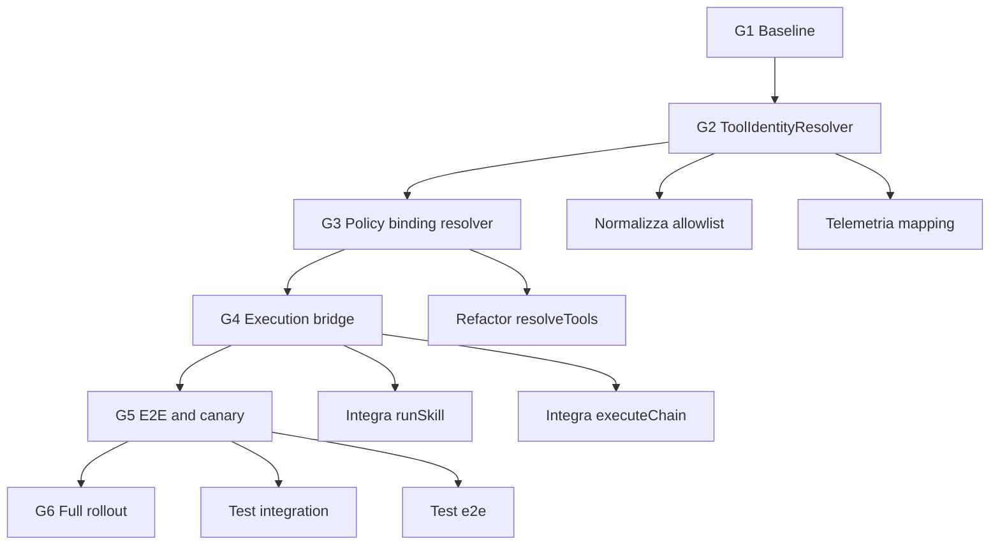

# KILOCLAW_SKILLS_TOOLS_RUNTIME_REMEDIATION_PLAN_2026-04-12

Piano operativo per chiudere il gap tra routing, policy e runtime esecutivo.

---

## Definisci obiettivo

Ripristinare una catena end-to-end affidabile in Kiloclaw: intent → routing agency → skill/tool execution reale → output verificabile.

Rendere coerenti identità tool policy e chiavi runtime MCP, eliminando mismatch nominali e fallback generico improprio.

---

## Delimita scope

### In scope

- Uniformare identità tool con resolver canonico alias→runtime per native + MCP
- Integrare execution bridge nel loop sessione verso `runSkill` e `executeChain`
- Distinguere chiaramente `load-skill` documentale da `execute-skill` operativo
- Aggiungere telemetria strutturata su gating, mapping, fallback e successo chain
- Introdurre test unit/integration/e2e sulla traversata completa
- Eseguire rollout progressivo con feature flag per agency

### Out of scope

- Riscrittura totale del routing semantico L0-L3
- Re-implementazione completa di tutti i tool MCP esterni
- Cambiamenti ai contratti API pubblici non necessari alla remediation
- Ottimizzazioni non bloccanti su UX/CLI fuori dalla catena runtime

---

## Descrivi stato target

Kiloclaw adotta una strategia ibrida: tool nativi per il core runtime e MCP per domini esterni con identità canonica unica.

Il loop sessione diventa orchestratore esecutivo, non solo router di contesto.

### Vincoli architetturali target

- Policy deny-by-default sempre applicata prima dell esposizione tool al modello
- `ToolIdentityResolver` come unica fonte di verità per alias, canonical ID e runtime key
- Routing L0-L3 obbligatoriamente collegato a `runSkill`/`executeChain` quando eseguibile
- `skill` tool documentale non può chiudere task operativi senza esecuzione reale
- Fallback generico consentito solo se resolver non trova mapping valido o policy nega tool specialistico

### Flusso target

1. Classificazione intent e route agency/capability/skill
2. Risoluzione tool canonica con mapping alias→runtime key
3. Applicazione policy e costruzione toolset effettivo
4. Execution bridge verso chain executor quando skill è operativa
5. Telemetria, audit e verifica outcome

---

## Pianifica roadmap

### P0 — Stabilizza identità tool e policy binding

Obiettivo: eliminare mismatch tra allowlist e tool runtime.

Deliverable P0:

- `ToolIdentityResolver` con registry alias/canonical/runtime
- Normalizzazione allowlist agency su ID canonici
- Refactor `resolveTools()` per usare resolver invece di match stringa-esatta
- Metriche baseline: `tool_policy_allowed`, `tool_policy_blocked`, `policy_alias_miss`, `tool_identity_resolved`

Exit criteria P0:

- Alias `gmail.search`, `finance-api`, `websearch` risolti correttamente quando tool esiste
- Nessun tool consentito bloccato per mismatch nominale
- Log sessione con evidenza mapping alias→runtime key

### P1 — Collega routing a esecuzione reale

Obiettivo: chiudere il gap decisione→esecuzione nel loop sessione.

Deliverable P1:

- Execution bridge nel loop sessione verso `runSkill`/`executeChain`
- Distinzione esplicita `load-skill` vs `execute-skill` nel tool `skill`
- Guardrail anti-falso-completamento su output `<skill_content ...>`
- Eventi runtime: `agency_chain_started`, `agency_chain_step`, `agency_chain_completed`, `agency_chain_failed`

Exit criteria P1:

- Flussi agency target eseguono step reali tracciati
- Nessun caso “skill loaded ma non eseguita” nei path operativi
- Riduzione fallback generic websearch nei task specialistici

### P2 — Consolida test, rollout e hardening

Obiettivo: validare robustezza in produzione con rollout graduale e rollback provato.

Deliverable P2:

- Suite integration/e2e end-to-end su knowledge, gworkspace, finance, nba
- Canary con SLO e alerting su metriche di regressione
- Runbook di rollback per agency e globale
- Report finale con KPI pre/post remediation

Exit criteria P2:

- Test critici verdi su tutte le agency target
- Fallback improprio ridotto rispetto alla baseline
- Rollout completato senza regressioni P0/P1

---

## Fissa milestone e gate

| Gate | Milestone          | Obiettivo                                            | Evidenza obbligatoria                |
| ---- | ------------------ | ---------------------------------------------------- | ------------------------------------ |
| G1   | Baseline congelata | Snapshot comportamento corrente e metriche iniziali  | report baseline + dashboard iniziale |
| G2   | Resolver operativo | Mapping alias/canonical/runtime attivo in sessione   | test unit resolver + log mapping     |
| G3   | Policy coerente    | `resolveTools()` usa resolver in produzione flaggata | integration test policy/runtime      |
| G4   | Bridge esecutivo   | Routing invoca chain executor nei path previsti      | trace `agency_chain_*`               |
| G5   | E2E stabile        | Suite e2e agency verdi con fallback sotto soglia     | report test + KPI comparativi        |
| G6   | Rollout completato | Canary→graduale→full con rollback validato           | checklist rollout + rollback drill   |

Regola GO/NO-GO: ogni gate richiede test verdi e telemetria coerente con soglie fase.

---

## Definisci deliverable per fase

### Deliverable P0

- Specifica tecnica `ToolIdentityResolver` con schema mapping
- Implementazione resolver + adapter per tool nativi e MCP
- Aggiornamento policy map in `session/tool-policy.ts`
- Logging strutturato di risoluzione e deny reason

### Deliverable P1

- Session execution bridge con policy guard e timeout
- Refactor `tool/skill.ts` con modalità documentale vs operativa
- Integrazione `runSkill`/`executeChain` nel loop sessione
- Event model per tracing chain e outcome

### Deliverable P2

- Test suite completa unit/integration/e2e
- Feature flags per agency con rollout config
- Dashboard osservabilità + alert policy
- Runbook operativo, rollback e postmortem template

---

## Disegna grafo dipendenze



Dipendenze chiave: G3 dipende da G2, G4 dipende da G3, G5 dipende da G4, G6 dipende da G5.

---

## Definisci strategia flag e migrazione

### Feature flags

- `kiloclaw.runtime.toolIdentityResolver.enabled`
- `kiloclaw.runtime.sessionExecutionBridge.enabled`
- `kiloclaw.runtime.skillTool.executeMode.enabled`
- `kiloclaw.runtime.noSilentFallback.enabled`
- `kiloclaw.runtime.agency.<knowledge|gworkspace|finance|nba>.enabled`

### Sequenza migrazione

1. Attiva resolver in shadow mode con sola telemetria
2. Abilita enforcement resolver su agency `knowledge`
3. Abilita execution bridge su `knowledge` e poi `gworkspace`
4. Estendi a `finance` e `nba` con canary progressivo
5. Abilita no-silent-fallback dopo stabilizzazione e2e

### Strategia compatibilità

Compatibilità backward con policy legacy garantita tramite fallback controllato dietro flag.

Rimozione compatibilità legacy solo dopo G6 e due cicli release stabili.

---

## Organizza osservabilità

### Metriche runtime

- `tool_policy_allowed_total{agency,tool}`
- `tool_policy_blocked_total{agency,tool,reason}`
- `tool_identity_resolved_total{alias,canonical,runtime}`
- `tool_identity_miss_total{alias,agency}`
- `agency_chain_started_total{agency,skill}`
- `agency_chain_completed_total{agency,skill,status}`
- `generic_fallback_total{agency,intent,reason}`
- `skill_loaded_not_executed_total{agency,skill}`

### Logging e tracing

- Correlation ID unico per sessione e chain
- Log strutturati per step bridge, decisioni policy, resolver hit/miss
- Trace spans: routing, policy, resolver, chain execution, tool calls

### Alerting SLO

- `policy_alias_miss_rate` > 2% per 15m
- `skill_loaded_not_executed_total` > 0 in path operativi
- `generic_fallback_rate` sopra baseline +20%
- `agency_chain_failed_rate` > 5% per agency canary

---

## Definisci strategia test

### Unit

- Resolver alias/canonical/runtime mapping
- Normalizzazione allowlist e deny reason
- Skill mode switch documentale vs operativo
- Guardrail no-silent-fallback

### Integration

- `resolveTools()` con tool nativi + MCP sanitizzati
- RoutingPipeline + execution bridge + chain executor
- Policy gating con flag attivi/disattivi

### E2E

- Flussi completi agency `knowledge`, `gworkspace`, `finance`, `nba`
- Verifica tool specialistico chiamato quando consentito
- Verifica fallback negato se mapping specialistico esiste

### Nuovi test minimi richiesti

- `packages/opencode/test/session/tool-identity-resolver.test.ts`
- `packages/opencode/test/session/gworkspace-policy-mcp-integration.test.ts`
- `packages/opencode/test/session/routing-to-chain-executor.integration.test.ts`
- `packages/opencode/test/session/agency-skill-execution.e2e.test.ts`
- `packages/opencode/test/session/no-silent-fallback.test.ts`

---

## Elenca worklist file-level

### Modificare

- `packages/opencode/src/session/prompt.ts`
  - Refactor `resolveTools()` con `ToolIdentityResolver`
  - Inserire execution bridge nel loop sessione
- `packages/opencode/src/session/tool-policy.ts`
  - Normalizzare allowlist su canonical ID
  - Esporre mapping capability→canonical tool IDs
- `packages/opencode/src/tool/skill.ts`
  - Separare `load-skill` documentale da `execute-skill`
  - Bloccare completamento operativo senza execution evidence
- `packages/opencode/src/mcp/index.ts`
  - Esportare metadata utili alla risoluzione identità tool
- `packages/opencode/src/kiloclaw/agency/routing-pipeline.ts`
  - Esportare segnali utili a bridge execution
- `packages/opencode/src/kiloclaw/agency/agents/exec.ts`
  - Hardening tracing per `runSkill`
- `packages/opencode/src/kiloclaw/agency/chain-executor.ts`
  - Hardening tracing per `executeChain`/`executeBestChain`

### Creare

- `packages/opencode/src/session/tool-identity-resolver.ts`
- `packages/opencode/src/session/tool-identity-map.ts`
- `packages/opencode/src/session/runtime-flags.ts`
- `packages/opencode/src/kiloclaw/telemetry/runtime-remediation.metrics.ts`
- `packages/opencode/test/session/tool-identity-resolver.test.ts`
- `packages/opencode/test/session/gworkspace-policy-mcp-integration.test.ts`
- `packages/opencode/test/session/routing-to-chain-executor.integration.test.ts`
- `packages/opencode/test/session/agency-skill-execution.e2e.test.ts`
- `packages/opencode/test/session/no-silent-fallback.test.ts`

---

## Esegui verifica comandi

Checklist comandi su `packages/opencode`.

```bash
bun run --cwd packages/opencode typecheck
bun run --cwd packages/opencode test test/session/tool-policy.test.ts
bun run --cwd packages/opencode test test/kiloclaw/routing-pipeline.test.ts
bun run --cwd packages/opencode test test/session/tool-identity-resolver.test.ts
bun run --cwd packages/opencode test test/session/gworkspace-policy-mcp-integration.test.ts
bun run --cwd packages/opencode test test/session/routing-to-chain-executor.integration.test.ts
bun run --cwd packages/opencode test test/session/agency-skill-execution.e2e.test.ts
bun run --cwd packages/opencode test test/session/no-silent-fallback.test.ts
bun run --cwd packages/opencode test
```

Criterio pass: typecheck verde, test nuovi verdi, nessuna regressione suite esistente.

---

## Stima timeline ed effort

### Stima complessiva

- Durata: 3 settimane operative + 1 settimana rollout controllato
- Effort: 22-28 giornate/uomo

### Breakdown per fase

| Fase | Durata     |       Effort | Team minimo              |
| ---- | ---------- | -----------: | ------------------------ |
| P0   | 4-5 giorni |  7-9 gg/uomo | 1 backend + 1 test       |
| P1   | 5-6 giorni | 8-10 gg/uomo | 1 backend + 1 runtime    |
| P2   | 4-5 giorni |  7-9 gg/uomo | 1 qa + 1 sre + 1 backend |

### Opportunità di parallelizzazione

- Track A: resolver + policy normalization
- Track B: execution bridge + skill mode split
- Track C: telemetria + dashboard + alert
- Track D: test automation integration/e2e

Track A e B convergono a G4, Track C e D possono partire in shadow già da G2.

---

## Gestisci rollback

### Principi rollback

Rollback per agency prima di rollback globale.

Ogni rollback deve essere idempotente e verificabile in meno di 15 minuti.

### Trigger rollback

- `agency_chain_failed_rate` oltre soglia critica per 30m
- aumento `generic_fallback_rate` > 50% vs baseline
- errori bloccanti su tool policy enforcement

### Livelli rollback

1. Disattiva `sessionExecutionBridge` per singola agency
2. Disattiva `toolIdentityResolver` enforcement e torna in observe mode
3. Ripristina policy mapping snapshot precedente
4. Rollback release corrente se degrado persiste

### Artefatti rollback

- Snapshot feature flags per ambiente
- Snapshot mapping resolver
- Runbook rollback con owner e tempi target

---

## Registra rischi

| ID  | Rischio                    | Probabilità | Impatto | Mitigazione                         | Piano rollback              |
| --- | -------------------------- | ----------- | ------- | ----------------------------------- | --------------------------- |
| R1  | Mapping alias incompleto   | Media       | Alto    | contract tests + telemetry hit/miss | flag resolver observe-only  |
| R2  | Loop inattesi nel bridge   | Media       | Alto    | timeout, max-step, circuit breaker  | disable bridge per agency   |
| R3  | Regressioni agent legacy   | Alta        | Medio   | canary per agency + matrice test    | rollback selettivo agency   |
| R4  | Overhead log/metriche      | Bassa       | Medio   | sampling e livelli log              | riduzione verbosity runtime |
| R5  | Divergenza policy ambienti | Media       | Medio   | snapshot policy in CI               | restore snapshot precedente |
| R6  | Falso completamento skill  | Media       | Alto    | enforcement execution evidence      | disable execute mode flag   |

---

## Definisci criteri accettazione

### Criteri globali

- Nessun mismatch nominale bloccante tra policy e runtime nei domini target
- Chain esecutiva attiva e tracciata nei path agency operativi
- Fallback generico ridotto in modo misurabile rispetto a baseline G1
- Nessun incremento di incidenti P0/P1 durante canary e graduale

### Criteri quantitativi

- `policy_alias_miss_rate` <= 1%
- `skill_loaded_not_executed_total` = 0 nei path operativi
- `generic_fallback_rate` ridotto almeno del 30% vs baseline
- `agency_chain_success_rate` >= 95% in canary stabile 72h

---

## Chiudi definition of done

- Gate `G1..G6` tutti in stato GO con evidenze archiviate
- Feature flags in stato target documentato per ogni ambiente
- Test unit/integration/e2e verdi in CI e local verification checklist completata
- Dashboard e alert attivi con runbook operativo
- Rollback drill eseguito con esito positivo
- Documento post-implementazione con KPI pre/post pubblicato

---

## Esegui playbook prima settimana

### Giorno 1

Congelare baseline metrica e comportamentale, poi creare design tecnico resolver.

Aprire branch remediation e creare skeleton file `tool-identity-resolver.ts` + test unit base.

### Giorno 2

Implementare mapping alias/canonical/runtime per native + MCP, poi integrare in `resolveTools()` in modalità observe-only.

Attivare telemetria hit/miss e validare con test `tool-policy` + nuovo unit resolver.

### Giorno 3

Normalizzare allowlist in `session/tool-policy.ts` su canonical ID.

Introdurre flag enforcement resolver e completare integration test GWorkspace/MCP.

### Giorno 4

Implementare execution bridge in `session/prompt.ts` verso `runSkill`/`executeChain` con timeout e max-step.

Aggiungere eventi `agency_chain_*` e test integration routing→chain executor.

### Giorno 5

Refactor `tool/skill.ts` con split load vs execute e guardrail anti-falso-completamento.

Scrivere e2e iniziale `agency-skill-execution` e `no-silent-fallback`, poi avviare canary interno.

### Giorno 6

Stabilizzare failure handling e migliorare logging/alert.

Correggere regressioni emerse in canary e chiudere requisiti G4.

### Giorno 7

Eseguire checklist completa typecheck/test, produrre report G1-G4 e decisione go per P2.

Preparare runbook rollout/rollback e piano canary multi-agency settimana 2.

---

## Allinea riferimenti

- `docs/analysis/SKILLS_TOOLS_ARCHITECTURE_AUDIT_2026-04-12.md`
- `docs/guide/KILOCLAW_AGENCY_AGENT_SKILL_TOOL_IMPLEMENTATION_GUIDE_2026-04-07.md`
- `packages/opencode/src/session/prompt.ts`
- `packages/opencode/src/session/tool-policy.ts`
- `packages/opencode/src/tool/skill.ts`
- `packages/opencode/src/mcp/index.ts`
- `packages/opencode/src/kiloclaw/agency/agents/exec.ts`
- `packages/opencode/src/kiloclaw/agency/chain-executor.ts`
