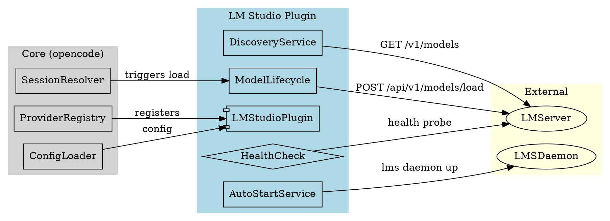

# Technical Design Document: LM Studio Provider Integration

**Version:** 1.0  
**Date:** 2026-04-04  
**Status:** Draft  
**Target:** Phase 0-6 Implementation

---

## 1. Overview

### Project Summary

Integrate LM Studio as a first-class local AI provider in Kiloclaw, enabling users to run local models via LM Studio's OpenAI-compatible API with automatic discovery, on-demand model loading, and optional auto-start of the LM Studio daemon.

### Architecture Summary

The integration follows a **plugin-first approach** inspired by `agustif/opencode-lmstudio`, minimizing core impact while providing a complete local AI provider experience. The plugin registers custom hooks for LM Studio-specific lifecycle management (discovery, model loading, auto-start) while leveraging the existing `@ai-sdk/openai-compatible` provider for inference.

### Key Design Principles

1. **Minimal core impact** - Plugin pattern isolates LM Studio logic
2. **Graceful degradation** - CLI remains usable if LM Studio is unavailable
3. **OpenAI-compatible inference** - Uses existing `/v1/chat/completions` endpoint
4. **LM Studio native APIs** - Uses `/api/v1/*` for model lifecycle
5. **Feature-flagged controls** - Each major feature individually controllable

---

## 2. Technology Stack

| Layer            | Technology                  | Rationale                       |
| ---------------- | --------------------------- | ------------------------------- |
| Language         | TypeScript                  | Required by monorepo            |
| Framework        | Existing plugin system      | Leverages `@kilocode/plugin`    |
| AI SDK           | `@ai-sdk/openai-compatible` | Already used for LM Studio      |
| Process spawning | `Process.spawn/run`         | Existing cross-platform wrapper |
| HTTP client      | Native `fetch`              | Bun native support              |
| Logging          | `Log.create()`              | Existing structured logging     |
| Events           | `Bus.publish()`             | Existing telemetry pattern      |

---

## 3. System Architecture

### 3.1 High-Level Component Diagram



### 3.2 Component Responsibilities

| Component          | Responsibility                                                  | Public API                                                       |
| ------------------ | --------------------------------------------------------------- | ---------------------------------------------------------------- |
| `LMStudioPlugin`   | Plugin entry point, registers hooks and custom loader           | `plugin(input): Hooks`                                           |
| `DiscoveryService` | Discover available models via `/v1/models` and `/api/v1/models` | `discoverModels(): Promise<DiscoveredModel[]>`                   |
| `ModelLifecycle`   | Load/unload models via `/api/v1/models/load`                    | `loadModel(id): Promise<void>`, `unloadModel(id): Promise<void>` |
| `AutoStartService` | Start LM Studio daemon via `lms daemon up`                      | `startDaemon(): Promise<boolean>`                                |
| `HealthCheck`      | Verify LM Studio server is reachable                            | `isHealthy(): Promise<boolean>`                                  |

### 3.3 Data Flow

```text
1. CLI Startup
   └─> Config.load()
       └─> Plugin.init()
           └─> LMStudioPlugin registers hooks

2. Provider Discovery (GET /v1/models)
   └─> ProviderRegistry loads lmstudio provider
       └─> LMStudioPlugin.auth.loader() called
           └─> DiscoveryService.discoverModels()
               ├─> HealthCheck.isHealthy()
               │   └─> AutoStartService.startDaemon() [if enabled]
               └─> fetch(GET /v1/models)
                   └─> Normalize to DiscoveredModel[]

3. Session Start (user selects lmstudio model)
   └─> SessionResolver resolves model
       └─> ModelLifecycle.loadModel(modelId) [if not loaded]
           └─> fetch(POST /api/v1/models/load)

4. Inference
   └─> Provider.getLanguage(model)
       └─> @ai-sdk/openai-compatible inference via /v1/chat/completions
```

---

## 4. Directory Structure

### 4.1 Plugin Location

```
packages/opencode/src/
├── kiloclaw/
│   └── lmstudio/
│       ├── index.ts              # Plugin entry point
│       ├── plugin.ts              # LMStudioPlugin class/module
│       ├── types.ts               # TypeScript interfaces
│       ├── config.ts             # Config loading/validation
│       ├── discovery.ts           # Model discovery service
│       ├── lifecycle.ts           # Model load/unload
│       ├── autostart.ts           # Daemon startup service
│       ├── health.ts              # Health check with retry
│       ├── errors.ts              # Custom error types
│       ├── telemetry.ts           # Event definitions
│       └── test/
│           ├── discovery.test.ts  # Unit tests
│           ├── lifecycle.test.ts  # Unit tests
│           ├── autostart.test.ts  # Unit tests
│           └── fixtures/
│               └── mock-lmstudio.ts
```

### 4.2 Alternative: Shared Package

If LM Studio functionality needs sharing across packages:

```
packages/
└── lmstudio-provider/
    ├── src/
    │   ├── index.ts
    │   ├── discovery.ts
    │   ├── lifecycle.ts
    │   ├── autostart.ts
    │   ├── health.ts
    │   └── types.ts
    └── package.json
```

**Decision:** Use `packages/opencode/src/kiloclaw/lmstudio/` (kilocode-specific directory per AGENTS.md conventions) for Phase 1-2. Migrate to shared package if Phase 6 (upstream core evaluation) succeeds.

---

## 5. API Contracts

### 5.1 LM Studio Provider Config

```typescript
// packages/opencode/src/kiloclaw/lmstudio/types.ts

export namespace LMStudioConfig {
  export const schema = z.object({
    enabled: z.boolean().default(true),
    baseURL: z.string().default("http://localhost:1234"),
    modelId: z.string().optional(), // Default model ID
    autoStart: z.boolean().default(false), // Feature flag: lmstudio.autoStart
    autoLoadModel: z.boolean().default(false), // Feature flag: lmstudio.autoLoadModel
    discoveryFallbackApiV1: z.boolean().default(true), // Feature flag: lmstudio.discoveryFallbackApiV1
    loadTimeout: z.number().default(300000), // 5 minutes
    healthCheckRetries: z.number().default(3),
    healthCheckRetryDelay: z.number().default(2000), // ms
    load: z
      .object({
        ttl: z.number().default(1800), // seconds
        priority: z.enum(["low", "normal", "high"]).default("normal"),
      })
      .optional(),
  })

  export type Info = z.infer<typeof schema>
}

// Config access path: config.provider?.["lmstudio"]?.options
// Feature flags from env: LMSTUDIO_AUTO_START, LMSTUDIO_AUTO_LOAD_MODEL, etc.
```

### 5.2 Discovered Model

```typescript
// packages/opencode/src/kiloclaw/lmstudio/types.ts

export interface DiscoveredModel {
  id: string // Model identifier from LM Studio
  name: string // Display name
  family?: string // Model family (e.g., "llama", "qwen")
  contextLength?: number // Context window size
  loaded: boolean // Whether model is currently loaded
  metadata?: Record<string, unknown> // Raw LM Studio metadata
}

export namespace DiscoveredModel {
  export const schema = z.object({
    id: z.string(),
    name: z.string(),
    family: z.string().optional(),
    contextLength: z.number().optional(),
    loaded: z.boolean().default(false),
    metadata: z.record(z.unknown()).optional(),
  })
}
```

### 5.3 Model Load Request/Response

```typescript
// packages/opencode/src/kiloclaw/lmstudio/types.ts

export interface LoadModelRequest {
  model: string // Model identifier
  ttl?: number // Time to live in seconds (default: 1800)
  priority?: "low" | "normal" | "high"
}

export interface LoadModelResponse {
  success: boolean
  model: string
  loaded: boolean
  message?: string
}

export interface UnloadModelRequest {
  model: string
}

export interface UnloadModelResponse {
  success: boolean
  model: string
  message?: string
}
```

### 5.4 Health Check

```typescript
// packages/opencode/src/kiloclaw/lmstudio/health.ts

export interface HealthStatus {
  reachable: boolean
  latencyMs?: number
  version?: string
  error?: string
}

export namespace HealthCheck {
  export async function check(
    baseURL: string,
    options?: { timeout?: number; retries?: number; retryDelay?: number },
  ): Promise<HealthStatus>
}
```

### 5.5 Discovery Service

```typescript
// packages/opencode/src/kiloclaw/lmstudio/discovery.ts

export namespace Discovery {
  /**
   * Discover models from LM Studio server.
   * Primary: GET /v1/models (OpenAI-compatible)
   * Fallback: GET /api/v1/models (LM Studio native)
   */
  export async function discoverModels(
    baseURL: string,
    options?: { fallbackApiV1?: boolean },
  ): Promise<DiscoveredModel[]>

  /**
   * Get list of currently loaded models.
   */
  export async function getLoadedModels(baseURL: string): Promise<DiscoveredModel[]>
}
```

### 5.6 Model Lifecycle Service

```typescript
// packages/opencode/src/kiloclaw/lmstudio/lifecycle.ts

export namespace Lifecycle {
  /**
   * Load a model on the LM Studio server.
   * POST /api/v1/models/load
   */
  export async function loadModel(
    baseURL: string,
    request: LoadModelRequest,
    options?: { timeout?: number },
  ): Promise<LoadModelResponse>

  /**
   * Unload a model from the LM Studio server.
   * POST /api/v1/models/unload
   */
  export async function unloadModel(
    baseURL: string,
    request: UnloadModelRequest,
    options?: { timeout?: number },
  ): Promise<UnloadModelResponse>

  /**
   * Check if a specific model is loaded.
   */
  export async function isModelLoaded(baseURL: string, modelId: string): Promise<boolean>
}
```

### 5.7 Auto-Start Service

```typescript
// packages/opencode/src/kiloclaw/lmstudio/autostart.ts

export interface AutoStartResult {
  success: boolean
  started: boolean // true if we started it, false if already running
  method?: "daemon" | "systemd" | "manual"
  error?: string
  instructions?: string // Guidance for manual start if auto-start fails
}

export namespace AutoStart {
  /**
   * Attempt to start LM Studio daemon.
   * Platform-specific behavior:
   * - Linux: lms daemon up, fallback to systemd
   * - macOS: lms daemon up
   * - Windows: lms daemon up via shell
   */
  export async function startDaemon(): Promise<AutoStartResult>

  /**
   * Check if lms binary is available.
   */
  export function isLMSAvailable(): Promise<boolean>

  /**
   * Get platform-specific startup instructions.
   */
  export function getStartupInstructions(): string
}
```

### 5.8 Plugin Interface

```typescript
// packages/opencode/src/kiloclaw/lmstudio/plugin.ts

import type { Hooks, PluginInput } from "@kilocode/plugin"
import type { Provider } from "ai"

export function createLMStudioPlugin(): (input: PluginInput) => Promise<Hooks> {
  return async (input: PluginInput): Promise<Hooks> => {
    return {
      auth: {
        provider: "lmstudio",
        methods: [
          { type: "api", label: "Local LM Studio", authorize: async () => ({ type: "success", key: "local" }) },
        ],
        loader: async (getAuth, provider: Provider) => {
          // 1. Load config
          // 2. If autoStart enabled and server not reachable, start daemon
          // 3. Discover models from /v1/models
          // 4. Return options with discovered models
          return {
            /* provider options */
          }
        },
      },
    }
  }
}
```

---

## 6. Data Models

### 6.1 LMStudioProviderOptions (Config Integration)

```typescript
// Merged into config.provider["lmstudio"] options

interface LMStudioProviderOptions {
  // Connection
  baseURL?: string // Default: http://localhost:1234

  // Model
  modelId?: string // Default model to use

  // Feature flags
  autoStart?: boolean // lmstudio.autoStart
  autoLoadModel?: boolean // lmstudio.autoLoadModel
  discoveryFallbackApiV1?: boolean // lmstudio.discoveryFallbackApiV1

  // Timeouts
  loadTimeout?: number // Model load timeout in ms
  healthCheckRetries?: number // Number of health check retries
  healthCheckRetryDelay?: number // Delay between retries in ms

  // Load parameters
  load?: {
    ttl?: number // Model TTL in seconds
    priority?: "low" | "normal" | "high"
  }
}
```

### 6.2 LMStudioModel (Provider Model Mapping)

```typescript
// How discovered models map to Provider.Model

interface LMStudioModel {
  id: string // Model ID from discovery
  providerID: "lmstudio"
  name: string // Display name
  family?: string // Model family
  api: {
    id: string // Same as id
    url: string // baseURL + /v1
    npm: "@ai-sdk/openai-compatible"
  }
  capabilities: {
    temperature: boolean // true
    reasoning: boolean // false (typically)
    toolcall: boolean // varies by model
    // ... standard capabilities
  }
  // ... standard Provider.Model fields
}
```

### 6.3 Session Context

```typescript
// Stored in session state for LM Studio-specific context

interface LMStudioSessionContext {
  providerID: "lmstudio"
  modelID: string
  baseURL: string
  modelLoaded: boolean
  modelLoadTime?: number // Timestamp when model was loaded
  lastUsed?: number // Timestamp of last inference
}
```

---

## 7. Integration Points

### 7.1 Provider Registry Integration

The plugin hooks into the provider system via the `auth.loader` hook:

```typescript
// In LMStudioPlugin
const loader: AuthHook["loader"] = async (getAuth, provider) => {
  const config = await Config.get()
  const lmConfig = config.provider?.["lmstudio"]

  if (!lmConfig?.options?.enabled) {
    return { autoload: false }
  }

  // Health check
  const health = await HealthCheck.check(lmConfig.options.baseURL)
  if (!health.reachable) {
    if (lmConfig.options.autoStart) {
      const startResult = await AutoStart.startDaemon()
      if (!startResult.success) {
        // Log warning, return graceful failure
        Bus.publish(LMStudioTelemetry.StartFailure, { error: startResult.error })
        return { autoload: false }
      }
      // Wait for server to be ready
      await waitForHealth(lmConfig.options.baseURL)
    } else {
      return { autoload: false }
    }
  }

  // Discover models
  const models = await Discovery.discoverModels(lmConfig.options.baseURL, {
    fallbackApiV1: lmConfig.options.discoveryFallbackApiV1,
  })

  Bus.publish(LMStudioTelemetry.ModelsDiscovered, { count: models.length })

  return {
    autoload: true,
    options: {
      baseURL: lmConfig.options.baseURL + "/v1",
      // ... normalized options for @ai-sdk/openai-compatible
    },
  }
}
```

### 7.2 Custom Loader Registration

```typescript
// In packages/opencode/src/provider/provider.ts

// Add to CUSTOM_LOADERS map:
const CUSTOM_LOADERS: Record<string, CustomLoader> = {
  // ... existing loaders
  lmstudio: async (provider) => {
    const config = await Config.get()
    const lmConfig = config.provider?.["lmstudio"]

    if (!lmConfig?.options?.enabled) {
      return { autoload: false }
    }

    return {
      autoload: lmConfig.options.autoLoadModel ?? false,
      async getModel(sdk: any, modelID: string, options?: Record<string, any>) {
        // If autoLoadModel enabled and model not loaded, load it
        if (lmConfig.options.autoLoadModel) {
          const loaded = await Lifecycle.isModelLoaded(lmConfig.options.baseURL, modelID)
          if (!loaded) {
            await Lifecycle.loadModel(lmConfig.options.baseURL, {
              model: modelID,
              ttl: lmConfig.options.load?.ttl,
              priority: lmConfig.options.load?.priority,
            })
          }
        }
        return sdk.languageModel(modelID)
      },
      options: {
        baseURL: (lmConfig.options.baseURL || "http://localhost:1234") + "/v1",
      },
    }
  },
}
```

### 7.3 Config Loader Integration

Feature flags from environment:

```typescript
// In packages/opencode/src/flag/flag.ts

export namespace Flag {
  // ... existing flags
  export const LMSTUDIO_AUTO_START = truthy("LMSTUDIO_AUTO_START")
  export const LMSTUDIO_AUTO_LOAD_MODEL = truthy("LMSTUDIO_AUTO_LOAD_MODEL")
  export const LMSTUDIO_DISCOVERY_FALLBACK_API_V1 = truthy("LMSTUDIO_DISCOVERY_FALLBACK_API_V1")
}
```

Config precedence (low to high):

1. Default values in `LMStudioConfig.schema`
2. Environment variables (`LMSTUDIO_*`)
3. `provider.lmstudio` in config file

### 7.4 Telemetry Integration

```typescript
// In packages/opencode/src/kiloclaw/lmstudio/telemetry.ts

export namespace LMStudioTelemetry {
  export const StartAttempt = BusEvent.define("lmstudio.start.attempt", z.object({ method: z.string() }))

  export const StartSuccess = BusEvent.define(
    "lmstudio.start.success",
    z.object({ method: z.string(), latencyMs: z.number() }),
  )

  export const StartFailure = BusEvent.define(
    "lmstudio.start.failure",
    z.object({ error: z.string(), method: z.string().optional() }),
  )

  export const ModelsDiscovered = BusEvent.define(
    "lmstudio.models.discovered",
    z.object({ count: z.number(), source: z.enum(["/v1/models", "/api/v1/models"]) }),
  )

  export const ModelLoadRequested = BusEvent.define("lmstudio.model.load.requested", z.object({ modelId: z.string() }))

  export const ModelLoadSuccess = BusEvent.define(
    "lmstudio.model.load.success",
    z.object({ modelId: z.string(), latencyMs: z.number() }),
  )

  export const ModelLoadFailure = BusEvent.define(
    "lmstudio.model.load.failure",
    z.object({ modelId: z.string(), error: z.string() }),
  )

  export const InferenceRequest = BusEvent.define(
    "lmstudio.inference.request",
    z.object({ modelId: z.string(), latencyMs: z.number().optional() }),
  )

  export const InferenceError = BusEvent.define(
    "lmstudio.inference.error",
    z.object({ modelId: z.string(), error: z.string() }),
  )
}
```

---

## 8. Error Handling

### 8.1 Error Types

```typescript
// packages/opencode/src/kiloclaw/lmstudio/errors.ts

export namespace LMStudioError {
  export class Base extends NamedError.create("LMStudioError", z.object({})) {}

  export class ServerUnreachable extends Base.create(
    "ServerUnreachable",
    z.object({ baseURL: z.string(), attempts: z.number() }),
  ) {}

  export class DiscoveryFailed extends Base.create(
    "DiscoveryFailed",
    z.object({ endpoint: z.string(), error: z.string() }),
  ) {}

  export class ModelLoadFailed extends Base.create(
    "ModelLoadFailed",
    z.object({ modelId: z.string(), error: z.string(), response: z.unknown().optional() }),
  ) {}

  export class ModelNotFound extends Base.create(
    "ModelNotFound",
    z.object({ modelId: z.string(), available: z.array(z.string()).optional() }),
  ) {}

  export class AutoStartFailed extends Base.create(
    "AutoStartFailed",
    z.object({ method: z.string(), error: z.string(), instructions: z.string().optional() }),
  ) {}

  export class Timeout extends Base.create("Timeout", z.object({ operation: z.string(), durationMs: z.number() })) {}
}
```

### 8.2 Graceful Degradation Strategies

| Scenario                                  | Behavior                               | User Message                                                             |
| ----------------------------------------- | -------------------------------------- | ------------------------------------------------------------------------ |
| LM Studio not running, autoStart disabled | CLI works, prompts to start LM Studio  | "LM Studio server not reachable. Start it manually or enable autoStart." |
| LM Studio not running, autoStart enabled  | Auto-start attempt, fallback to prompt | Auto-start logs + manual instructions if failed                          |
| Model not loaded, autoLoadModel disabled  | Error with load instructions           | "Model not loaded. Load it in LM Studio or enable autoLoadModel."        |
| Model not loaded, autoLoadModel enabled   | Auto-load attempt                      | Logs model load progress                                                 |
| Model load fails                          | Session continues with error           | "Failed to load model: {error}. Check LM Studio."                        |
| Discovery fails                           | Empty model list, CLI usable           | "Could not discover models. Check LM Studio server."                     |
| Inference timeout                         | Error returned to user                 | "Inference timed out. Try a smaller model or increase timeout."          |

### 8.3 Error Recovery

```typescript
// Health check with exponential backoff
async function waitForHealth(baseURL: string, maxRetries = 5): Promise<boolean> {
  for (let i = 0; i < maxRetries; i++) {
    const health = await HealthCheck.check(baseURL, { timeout: 5000 })
    if (health.reachable) return true

    const delay = Math.min(1000 * Math.pow(2, i), 30000)
    await new Promise((resolve) => setTimeout(resolve, delay))
  }
  return false
}
```

---

## 9. Feature Flags Implementation

### 9.1 Flag Definitions

| Flag                              | Environment Variable                 | Type    | Default | Description                                         |
| --------------------------------- | ------------------------------------ | ------- | ------- | --------------------------------------------------- |
| `lmstudio.autoStart`              | `LMSTUDIO_AUTO_START`                | boolean | `false` | Automatically start LM Studio daemon if not running |
| `lmstudio.autoLoadModel`          | `LMSTUDIO_AUTO_LOAD_MODEL`           | boolean | `false` | Automatically load model before session starts      |
| `lmstudio.discoveryFallbackApiV1` | `LMSTUDIO_DISCOVERY_FALLBACK_API_V1` | boolean | `true`  | Fall back to `/api/v1/models` if `/v1/models` fails |

### 9.2 Flag Usage

```typescript
// In LMStudioPlugin or service modules

import { Flag } from "../../flag/flag"

// Usage
const shouldAutoStart = Flag.LMSTUDIO_AUTO_START || config.provider?.["lmstudio"]?.options?.autoStart
const shouldAutoLoad = Flag.LMSTUDIO_AUTO_LOAD_MODEL || config.provider?.["lmstudio"]?.options?.autoLoadModel
const shouldFallbackDiscovery =
  Flag.LMSTUDIO_DISCOVERY_FALLBACK_API_V1 ?? config.provider?.["lmstudio"]?.options?.discoveryFallbackApiV1
```

---

## 10. Testing Strategy

### 10.1 Unit Tests

**Location:** `packages/opencode/src/kiloclaw/lmstudio/test/`

| Test File           | Coverage                                       |
| ------------------- | ---------------------------------------------- |
| `discovery.test.ts` | Model discovery normalization, fallback logic  |
| `lifecycle.test.ts` | Load/unload request building, response parsing |
| `health.test.ts`    | Health check timeout, retry logic              |
| `autostart.test.ts` | Platform detection, command building           |
| `errors.test.ts`    | Error type creation, serialization             |

**Mock Strategy:** Use `bun:test` with inline mocks for HTTP responses. No external LM Studio required.

```typescript
// Example: packages/opencode/src/kiloclaw/lmstudio/test/discovery.test.ts

import { describe, test, expect, beforeEach } from "bun:test"
import { Discovery } from "../discovery"
import { createMockServer } from "./fixtures/mock-lmstudio"

describe("Discovery", () => {
  let mockServer: ReturnType<typeof createMockServer>

  beforeEach(() => {
    mockServer = createMockServer({
      "/v1/models": {
        models: [
          { id: "qwen2.5-coder-7b", object: "model" },
          { id: "llama-3-8b", object: "model" },
        ],
      },
    })
  })

  test("discovers models from /v1/models", async () => {
    const models = await Discovery.discoverModels(mockServer.url)
    expect(models).toHaveLength(2)
    expect(models[0].id).toBe("qwen2.5-coder-7b")
  })

  test("falls back to /api/v1/models when primary fails", async () => {
    mockServer.disable("/v1/models")
    mockServer.enable("/api/v1/models", {
      data: [{ id: "qwen2.5-coder-7b", name: "Qwen 2.5 Coder 7B" }],
    })

    const models = await Discovery.discoverModels(mockServer.url, {
      fallbackApiV1: true,
    })
    expect(models).toHaveLength(1)
  })
})
```

### 10.2 Integration Tests

**Location:** `packages/opencode/test/integration/lmstudio.test.ts`

Requires running LM Studio instance (skipped if not available):

```typescript
import { describe, test, expect, beforeAll, afterAll } from "bun:test"
import { startLMStudio, stopLMStudio } from "./fixtures/lmstudio-fixture"

describe("LM Studio Integration", () => {
  let lmStudio: { url: string; stop: () => Promise<void> }

  beforeAll(async () => {
    lmStudio = await startLMStudio().catch(() => {
      // Skip if LM Studio not available
      return { url: "", stop: async () => {} }
    })
  })

  afterAll(async () => {
    await lmStudio.stop()
  })

  test(
    "discovers models from real LM Studio",
    async () => {
      if (!lmStudio.url) return // Skip

      const models = await Discovery.discoverModels(lmStudio.url)
      expect(models.length).toBeGreaterThan(0)
    },
    { skip: !lmStudio.url },
  )
})
```

### 10.3 E2E Tests

**Location:** `packages/opencode/test/e2e/lmstudio-cli.test.ts`

Tests complete user flow:

```typescript
test("complete LM Studio session flow", async () => {
  await using tmp = await tmpdir({
    config: {
      provider: {
        lmstudio: {
          options: {
            baseURL: "http://localhost:1234",
            autoStart: true,
            autoLoadModel: true,
          },
        },
      },
      model: "lmstudio/qwen2.5-coder-7b",
    },
  })

  // This would require actual LM Studio running or mock
  // Focus on testing the config → plugin → provider flow
})
```

### 10.4 Test Matrix

| Scenario                               | Unit     | Integration | E2E |
| -------------------------------------- | -------- | ----------- | --- |
| Server already running                 | ✓        | ✓           | ✓   |
| Server not running, autoStart enabled  | ✓ (mock) | ✓           | ✓   |
| Server not running, autoStart disabled | ✓ (mock) | ✓           | ✓   |
| Model already loaded                   | ✓ (mock) | ✓           | ✓   |
| Model not loaded, autoLoad enabled     | ✓ (mock) | ✓           | ✓   |
| Discovery via /v1/models               | ✓ (mock) | ✓           | ✓   |
| Discovery fallback to /api/v1/models   | ✓ (mock) | ✓           | -   |
| Custom port configured                 | ✓ (mock) | ✓           | ✓   |
| Health check timeout                   | ✓        | ✓           | -   |

---

## 11. Implementation Phases

### Phase 0: Technical Validation (1-2 days)

**Objectives:**

- Validate LM Studio API endpoints
- Confirm compatibility with existing config
- Establish baseline compatibility matrix

**Deliverables:**

- Compatibility matrix document
- API validation test results

**Tasks:**

- [ ] Verify `/v1/models` returns expected format
- [ ] Verify `/api/v1/models/load` accepts correct payload
- [ ] Test with different LM Studio versions
- [ ] Document known limitations

### Phase 1: Model Discovery (2-3 days)

**Objectives:**

- Implement discovery service
- Add to provider registry
- Display available models to user

**Deliverables:**

- `packages/opencode/src/kiloclaw/lmstudio/discovery.ts`
- `packages/opencode/src/kiloclaw/lmstudio/types.ts`
- CLI command to list local models

**Tasks:**

- [ ] Create `LMStudioConfig.schema` in types.ts
- [ ] Implement `Discovery.discoverModels()` with primary + fallback
- [ ] Implement `Discovery.getLoadedModels()`
- [ ] Add to `CUSTOM_LOADERS` in provider.ts
- [ ] Add telemetry events

### Phase 2: Load On-Demand (2-3 days)

**Objectives:**

- Implement model loading via `/api/v1/models/load`
- Add auto-load option
- Handle load failures gracefully

**Deliverables:**

- `packages/opencode/src/kiloclaw/lmstudio/lifecycle.ts`
- Integration with session resolver

**Tasks:**

- [ ] Implement `Lifecycle.loadModel()`
- [ ] Implement `Lifecycle.unloadModel()`
- [ ] Implement `Lifecycle.isModelLoaded()`
- [ ] Add load timeout configuration
- [ ] Add error handling with user guidance
- [ ] Add telemetry events

### Phase 3: Auto-Start LM Studio (2-3 days)

**Objectives:**

- Detect when LM Studio is not running
- Attempt to start daemon automatically
- Provide fallback instructions on failure

**Deliverables:**

- `packages/opencode/src/kiloclaw/lmstudio/autostart.ts`
- Platform-specific startup handling

**Tasks:**

- [ ] Implement `AutoStart.isLMSAvailable()`
- [ ] Implement `AutoStart.startDaemon()` with platform detection
- [ ] Linux: try `lms daemon up`, then systemd
- [ ] macOS: try `lms daemon up`
- [ ] Windows: try `lms daemon up` via shell
- [ ] Implement `AutoStart.getStartupInstructions()`
- [ ] Add telemetry events
- [ ] Graceful degradation if auto-start fails

### Phase 4: CLI Session Integration (2-3 days)

**Objectives:**

- Connect LM Studio provider to session resolver
- Support model selection from discovered list
- Route inference to correct endpoint

**Deliverables:**

- Full end-to-end session flow working
- Error messages tailored for local providers

**Tasks:**

- [ ] Integrate with session model resolution
- [ ] Support user override of auto-selected model
- [ ] Handle inference errors with local-specific guidance
- [ ] Update documentation with new auto-start/auto-load features

### Phase 5: Observability and Hardening (2-3 days)

**Objectives:**

- Structured logging throughout
- Metrics collection
- Circuit breaker on repeated failures

**Deliverables:**

- Complete telemetry event emission
- Structured logs in all关键 paths
- Debugging guide for LM Studio issues

**Tasks:**

- [ ] Ensure all services emit structured logs
- [ ] Implement circuit breaker for LM Studio calls
- [ ] Add latency metrics for model load and inference
- [ ] Document log filtering for LM Studio events
- [ ] Security audit: sanitize paths from logs

### Phase 6: Upstream Core Evaluation (1-2 days)

**Objectives:**

- Evaluate whether to keep as plugin or move to core
- Document decision with evidence

**Deliverables:**

- Decision record: plugin vs. core
- If core: migration plan and diff

**Tasks:**

- [ ] Collect metrics from Phase 1-5 usage
- [ ] Assess plugin quality and stability
- [ ] Evaluate upstream interest
- [ ] Document decision and rationale

---

## 12. Security Considerations

### 12.1 Security Checklist

- [ ] **No hardcoded credentials** - LM Studio uses no API keys
- [ ] **Input validation** - Validate model IDs before calling load/unload
- [ ] **Shell injection prevention** - Use parameterized commands in auto-start
- [ ] **Localhost only by default** - baseURL defaults to `localhost:1234`
- [ ] **Path sanitization** - Sanitize model IDs from discovery before logging
- [ ] **Download validation** - Model downloads are explicit user action only

### 12.2 Shell Command Safety

```typescript
// SAFE: Using array for command
Process.spawn(["lms", "daemon", "up"], { windowsHide: true })

// UNSAFE: String interpolation
// const cmd = `lms daemon up --model ${modelId}`;  // DO NOT DO THIS
```

---

## 13. Configuration Reference

### 13.1 Full Config Schema

```jsonc
{
  "provider": {
    "lmstudio": {
      "options": {
        // Connection
        "baseURL": "http://localhost:1234",

        // Model
        "modelId": "qwen2.5-coder-7b-instruct",

        // Feature flags
        "autoStart": false,
        "autoLoadModel": false,
        "discoveryFallbackApiV1": true,

        // Timeouts
        "loadTimeout": 300000,
        "healthCheckRetries": 3,
        "healthCheckRetryDelay": 2000,

        // Load parameters
        "load": {
          "ttl": 1800,
          "priority": "normal",
        },
      },
    },
  },
}
```

### 13.2 Environment Variable Overrides

| Variable                             | Description                    |
| ------------------------------------ | ------------------------------ |
| `LMSTUDIO_BASE_URL`                  | Override base URL              |
| `LMSTUDIO_AUTO_START`                | Enable auto-start (true/false) |
| `LMSTUDIO_AUTO_LOAD_MODEL`           | Enable auto-load (true/false)  |
| `LMSTUDIO_DISCOVERY_FALLBACK_API_V1` | Enable discovery fallback      |

---

## 14. Migration Guide

### 14.1 From Manual to Automated

**Before (Phase 0):**

1. User starts LM Studio manually
2. User loads model in LM Studio UI
3. User configures `provider.lmstudio.baseURL`
4. User selects model in CLI

**After (Phase 3+ with flags enabled):**

1. User configures `provider.lmstudio.options.autoStart: true`
2. User selects model in CLI
3. System auto-starts LM Studio daemon if needed
4. System auto-loads model if needed
5. Session starts automatically

**Rollback:**

- Set `autoStart: false` and `autoLoadModel: false` to disable automation
- Provider still works with manual LM Studio startup

---

## 15. Decision Log

| Decision                  | Rationale                                                 | Alternatives Considered                       |
| ------------------------- | --------------------------------------------------------- | --------------------------------------------- |
| Plugin-first approach     | Faster time-to-value, lower risk, easy rollback           | Build into core (rejected - higher risk)      |
| `/v1/*` for inference     | Leverages existing `@ai-sdk/openai-compatible`            | Custom adapter (unnecessary complexity)       |
| `/api/v1/*` for lifecycle | LM Studio native APIs for model management                | Only use OpenAI-compatible (insufficient)     |
| Feature-flagged autoStart | User control over automatic system changes                | Always auto-start (too opinionated)           |
| TTL default 1800s         | 30-minute default balances resource usage and convenience | No TTL (wasteful), shorter TTL (inconvenient) |

---

## 16. Open Questions / Clarifications Needed

1. **LM Studio Version Compatibility:**
   - What minimum LM Studio version is required?
   - Are there breaking changes in recent versions?

2. **Model ID Normalization:**
   - Should model IDs from discovery be normalized (e.g., removing file extensions)?
   - What about model ID matching with user config?

3. **Session Unload Behavior:**
   - Should models be unloaded when session ends?
   - Configurable via flag?

4. **Multi-Model Support:**
   - Can multiple models be loaded simultaneously?
   - How to handle model selection when multiple are loaded?

5. **Telemetry Privacy:**
   - Are there privacy concerns with reporting local model usage?
   - Should telemetry be opt-in for local providers?

---

## Appendix A: LM Studio API Reference

### A.1 OpenAI-Compatible Endpoints (Inference)

| Method | Endpoint               | Purpose               |
| ------ | ---------------------- | --------------------- |
| GET    | `/v1/models`           | List available models |
| POST   | `/v1/chat/completions` | Chat completions      |
| POST   | `/v1/completions`      | Text completions      |
| POST   | `/v1/embeddings`       | Embeddings            |

### A.2 LM Studio Native Endpoints (Lifecycle)

| Method | Endpoint                  | Purpose                        |
| ------ | ------------------------- | ------------------------------ |
| GET    | `/api/v1/models`          | List models with detailed info |
| POST   | `/api/v1/models/load`     | Load a model                   |
| POST   | `/api/v1/models/unload`   | Unload a model                 |
| POST   | `/api/v1/models/download` | Download a model               |

### A.3 Load Model Request Example

```http
POST http://localhost:1234/api/v1/models/load
Content-Type: application/json

{
  "model": "qwen2.5-coder-7b-instruct",
  "ttl": 1800,
  "priority": "normal"
}
```

### A.4 Load Model Response Example

```json
{
  "success": true,
  "model": "qwen2.5-coder-7b-instruct",
  "loaded": true,
  "message": "Model loaded successfully"
}
```

---

_Document Version: 1.0_  
_Last Updated: 2026-04-04_  
_Author: Architect Agent_
